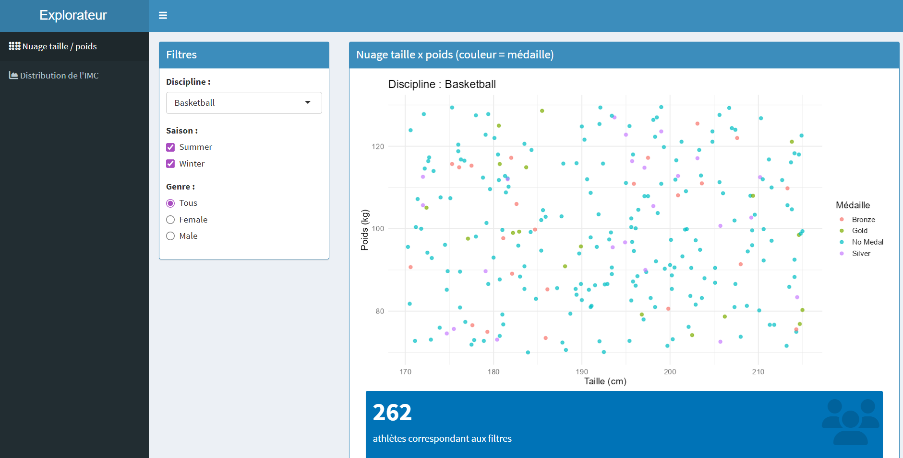

```{r,echo = FALSE, warning = FALSE, message = FALSE}
library(tidyverse)
```

# Projet IF36 - DataSquad : Analyse des Données Olympiques (1896-2024)

## Présentation des données

Les données exploitées dans le cadre de ce projet proviennent d'un jeu de données extrait de la plateforme Kaggle, dans un format en `.csv`. Il contient les informations d’athlètes pendant les Jeux Olympiques de 1896 à 2024.

Nous avons choisi ce set de données car cela nous paraissait très intéressant, nous aimons bien le sport, extraire des statistiques de ce dataset peut-être très instructif. Nous avons vu un potentiel dans ce dataset, il nous permet de nous poser les bonnes questions, qui nous amèneront des graphiques et statistiques pertinents.

Nous avons donc une base de données de 8500 athlètes, avec des données sur 30 catégories. Ces variables couvrent à la fois les résultats sportifs des individus (répartition des médailles, records, valeur des résultats) et leurs profils biométriques et identitaires (pays d'origine, taille, poids, etc.).

## Types de données

| \# | Nom de la colonne | Format donnée | Description | Type |
|----|----|----|----|----|
| 1 | `athlete_id` | String | ID unique (format ATH-00001 à ATH-08500) | Discrète (Identifiant) |
| 2 | `athlete_name` | String | Nom complet (Prénom + Nom) | Discrète (Nominale) |
| 3 | `gender` | String | Sexe de l'athlète (Male/Female) | Discrète (Nominale) |
| 4 | `age` | Integer | Âge au moment de l'événement (15-42) | Discrète |
| 5 | `date_of_birth` | Date | Date de naissance (YYYY-MM-DD) | Continue (Temporelle) |
| 6 | `nationality` | String | Code CIO du pays sur 3 lettres (ex: USA, FRA) | Discrète (Nominale) |
| 7 | `country_name` | String | Nom complet du pays | Discrète (Nominale) |
| 8 | `sport` | String | Discipline (ex: Athlétisme, Natation) | Discrète (Nominale) |
| 9 | `event` | String | Épreuve spécifique (ex: 100m Sprint) | Discrète (Nominale) |
| 10 | `games_type` | String | Type de jeux (Summer / Winter) | Discrète (Nominale) |
| 11 | `year` | Integer | Année des JO (1896-2024) | Discrète (Temporelle) |
| 12 | `host_city` | String | Ville hôte des Jeux | Discrète (Nominale) |
| 13 | `team_or_individual` | String | Épreuve par équipe ou individuelle | Discrète (Nominale) |
| 14 | `medal` | String | Médaille : Gold, Silver, Bronze ou None | Discrète (Ordinale) |
| 15 | `result_value` | Float | Résultat chiffré (temps, distance, score) | Continue |
| 16 | `result_unit` | String | Unité du résultat (seconds, metres, points, kg) | Discrète (Nominale) |
| 17 | `total_olympics` | Integer | Nombre total de JO fréquentés (1-5) | Discrète |
| 18 | `total_medals_won` | Integer | Total de médailles en carrière | Discrète |
| 19 | `gold_medals` | Integer | Nombre de médailles d'or en carrière | Discrète |
| 20 | `silver_medals` | Integer | Nombre de médailles d'argent en carrière | Discrète |
| 21 | `bronze_medals` | Integer | Nombre de médailles de bronze en carrière | Discrète |
| 22 | `country_total_gold` | Integer | Total historique d'or du pays (jusqu'en 2024) | Discrète |
| 23 | `country_total_medals` | Integer | Total historique de médailles du pays | Discrète |
| 24 | `country_first_part` | Integer | Année de la première participation du pays | Discrète (Temporelle) |
| 25 | `country_best_rank` | Integer | Meilleur classement historique du pays | Discrète (Ordinale) |
| 26 | `is_record_holder` | String | Record : World Record / Olympic Record / No | Discrète (Nominale) |
| 27 | `coach_name` | String | Nom de l'entraîneur | Discrète (Nominale) |
| 28 | `height_cm` | Float | Taille de l'athlète en centimètres | Continue |
| 29 | `weight_kg` | Float | Poids de l'athlète en kilogrammes | Continue |
| 30 | `notes` | String | Contexte supplémentaire (ex: "Personal Best") | Discrète (Texte libre) |

## Plan d’analyse

### Questions de recherche

Les questions sont structurées en 4 grands thèmes :

- **MORPHOLOGIE : Impact sur performance** : Analyse des caractéristiques physiques des athlètes (taille, poids, IMC), de leur répartition par discipline, et de leur influence sur la performance (Questions 1 à 8).
- **GÉOPOLITIQUE : Pays dominants** : Étude du succès national, de la domination historique de certains pays, de l'effet d'être pays hôte et de l'efficacité des délégations (Questions 9 à 13).
- **ÉQUITÉ : Genre & représentativité** : Analyse de la parité hommes/femmes, de la représentativité des nationalités et des disciplines sportives, et de l'effet d'âge relatif (Questions 14 à 17).
- **TEMPORALITÉ : Évolution des JO** : Étude de l'évolution de la participation par saison, de l'âge des médaillés, de l'expérience, de la spécialisation des corps dans le temps et de la longévité de carrière (Questions 18 à 23).

### Interrogations et objectifs

Notre analyse gravite autour d'une problématique centrale : **L'influence de la morphologie (taille et poids) sur la performance athlétique.** Nous cherchons à déterminer si des caractéristiques physiques spécifiques constituent un avantage déterminant pour l'obtention d'une médaille ou d'un record.

**Objectifs secondaires :** \* Existe-t-il une "taille idéale" par discipline sportive ? \* Le rapport poids/taille (IMC) est-il plus corrélé à la performance que la taille seule ? \* Cette influence morphologique a-t-elle évolué entre les premiers Jeux Olympiques et les éditions récentes (spécialisation des corps) ?

### Informations attendues

Nous espérons identifier des clusters d'athlètes performants par sport. Par exemple, nous anticipons une corrélation positive forte entre la taille et la performance en basketball ou en natation, tandis qu'elle pourrait être négative ou inexistante en gymnastique ou en équitation.

### Variables comparées et méthodes

Pour valider nos hypothèses, nous allons croiser les variables suivantes : 1. **Taille (height_cm) vs Performance (result_value)** : Utilisation de nuages de points pour visualiser la dispersion et calcul du coefficient de corrélation de Pearson ($r$). 2. **Poids (weight_kg) vs Sport (sport)** : Comparaison des distributions via des boîtes à moustaches (boxplots) pour voir la variabilité du poids selon la discipline. 3. **Médaille (medal) vs Morphologie** : Analyse par groupes pour voir si les médaillés d'or présentent des caractéristiques physiques distinctes du reste des participants.

## Défis et limites potentiels

- **Hétérogénéité des unités** : La variable `result_value` mélange des secondes, des mètres et des points. Il faudra normaliser ces données ou filtrer l'analyse sport par sport.
- **Données manquantes** : Les données historiques comportent souvent des valeurs de poids ou de taille manquantes, ce qui pourrait biaiser l'analyse temporelle.
- **Variables confondantes** : La performance dépend aussi de l'âge, de l'expérience (`total_olympics`) et des infrastructures du pays d'origine.

# Rapport de l'étude de base de données :

```{r,echo = FALSE, warning = FALSE, message = FALSE}
library(readr)
library(dplyr)
library(ggplot2)
```

```{r,echo = FALSE, warning = FALSE, message = FALSE}
dataset = read_csv("data/olympics_athletes_dataset.csv")
olympics = dataset
```

# MORPHOLOGIE : Impact sur performance

## Question 1 : Existe-t-il une corrélation visuelle entre la taille et le poids des athlètes, toutes disciplines confondues ?

**Hypothèse :** 
Nous supposons qu'il existe une corrélation positive entre la taille et le poids des athlètes. En général, les athlètes les plus grands ont également tendance à être plus lourds.

Nous nous attendons donc à observer une tendance croissante reliant ces deux variables. Cette analyse permet également de détecter d'éventuelles valeurs aberrantes ou incohérentes dans le dataset.arquée.

```{r, echo = FALSE, warning = FALSE, message = FALSE}

height_weight <- olympics |>
  filter(
    !is.na(height_cm),
    !is.na(weight_kg)
  )

ggplot(height_weight,
       aes(x = height_cm,
           y = weight_kg)) +
  geom_point(alpha = 0.4, color = "blue") +
  geom_smooth(method = "lm",
              se = FALSE,
              color = "red") +
  labs(
    title = "Relation entre la taille et le poids des athlètes",
    x = "Taille (cm)",
    y = "Poids (kg)"
  ) +
  theme_minimal()
```

#### Choix du graphique

Nous avons choisi un nuage de points car il permet de représenter la relation entre deux variables quantitatives : la taille et le poids. L'ajout d'une ligne de tendance linéaire facilite l'identification d'une corrélation générale entre ces deux caractéristiques physiques.

### Interprétation

Ce graphique montre une relation positive entre la taille et le poids . La droite de tendance est croissante, ce qui montre que les athlètes les plus grands ont généralement tendance à être plus lourds. On peut aussi observer une dispersion importante des points autour de cette tendance, ce qui indique que la taille n'est pas le seul facteur influençant le poids. Cette variabilité peut s'expliquer par les différences entre disciplines sportives, certaines favorisant des profils plus légers tandis que d'autres nécessitent davantage de masse corporelle. Malgré cette dispersion, aucune anomalie majeure n'apparaît visuellement et les données semblent globalement cohérentes.

## Question 2 : Chaque discipline possède-t-elle une « empreinte morphologique » qui lui est propre ?

La Question 1 a montré une corrélation globale entre la taille et le poids des athlètes, toutes disciplines confondues. Mais cette nuée de points globale cache peut-être plusieurs *sous-populations* : un basketteur et un gymnaste n'ont rien à voir physiquement. Nous cherchons donc ici à savoir si chaque discipline occupe une **zone distincte** du plan taille × poids, formant une véritable « empreinte morphologique ».

**Hypothèse :** chaque discipline impose des contraintes physiques spécifiques. On devrait donc observer des nuages de densité nettement séparés (les basketteurs grands et lourds, les gymnastes petits et légers, les haltérophiles courts mais très massifs, etc.).

#### Choix du graphique

Pour répondre, un simple nuage de points serait illisible (8500 points superposés). Nous utilisons donc une **carte de densité 2D** (`geom_density_2d_filled`) : au lieu d'afficher chaque athlète, elle colorie les zones du plan selon la *concentration* d'athlètes. Plus une zone est claire, plus les athlètes y sont nombreux. En affichant une facette par discipline, on compare directement les « empreintes » côte à côte. Nous complétons par une seconde vue où toutes les disciplines sont superposées sur un même plan, avec une **ellipse de confiance à 95 %** par discipline, qui résume d'un seul trait la zone occupée par chaque sport.

```{r q19_densite_morpho, echo = FALSE, warning = FALSE, message = FALSE, fig.width = 9, fig.height = 7}

morpho <- dataset

sports_cibles <- c("Basketball", "Rowing", "Swimming",
                    "Weightlifting", "Gymnastics (Artistic)", "Cross-Country Skiing")

morpho_sel <- morpho %>%
  filter(sport %in% sports_cibles)

ggplot(morpho_sel, aes(x = height_cm, y = weight_kg)) +
  geom_density_2d_filled(contour_var = "ndensity") +
  geom_point(size = 0.4, alpha = 0.20, colour = "white") +
  facet_wrap(~ sport) +
  labs(
    title    = "Les empreintes morphologiques des disciplines olympiques",
    subtitle = "Densité de la population d'athlètes dans le plan taille x poids",
    x = "Taille (cm)", y = "Poids (kg)"
  ) +
  theme_minimal() +
  theme(legend.position = "none")+
  theme(
    legend.position = "none",
    plot.title  = element_text(face = "bold"),
    axis.title  = element_text(face = "bold")
  )
```

```{r q19_ellipses, echo = FALSE, warning = FALSE, message = FALSE, fig.width = 9, fig.height = 6}
ggplot(morpho_sel, aes(x = height_cm, y = weight_kg, colour = sport)) +
  geom_point(alpha = 0.30, size = 1) +
  stat_ellipse(type = "norm", level = 0.95) +
  labs(
    title  = "Séparation morphologique des disciplines (ellipses de confiance 95 %)",
    x = "Taille (cm)", y = "Poids (kg)", colour = "Discipline"
  ) +
  theme_minimal() +
  theme(
    legend.position = "none",
    plot.title  = element_text(face = "bold"),
    axis.title  = element_text(face = "bold")
  )
```

#### Interprétation

Les deux graphiques confirment nettement notre hypothèse : **chaque discipline occupe sa propre région du plan taille × poids**, et les empreintes se chevauchent peu.

- La **Gymnastique (Artistique)** forme une tache compacte en bas à gauche : athlètes petits ($\approx$ 163 cm) et légers ($\approx$ 58 kg), profil idéal pour les figures acrobatiques.
- Le **Basketball** se situe à l'opposé, en haut à droite : grands ($\approx$ 193 cm) et lourds ($\approx$ 100 kg).
- L'**Aviron (Rowing)** et la **Natation (Swimming)** dessinent des nuages allongés de grande taille mais de poids modéré (gabarits longs et secs).
- L'**Haltérophilie (Weightlifting)** est remarquable : taille moyenne ($\approx$ 175 cm) mais poids extrêmement variable (jusqu'à \~150 kg), d'où une empreinte très étirée verticalement - reflet des catégories de poids, des poids plumes aux super-lourds.
- Le **Ski de fond (Cross-Country Skiing)** occupe une zone d'endurance : gabarit intermédiaire et resserré.

Les ellipses de confiance résument ce constat : elles se touchent à peine. Autrement dit, la nuée globale observée en Question 1 était bien la **superposition de plusieurs populations distinctes**. La morphologie n'est pas le fruit du hasard : c'est une signature de la discipline.

#### Conclusion

La densité 2D s'avère bien plus parlante qu'un nuage de points classique : elle révèle que la question « quelle est la morphologie d'un athlète olympique ? » n'a pas de réponse unique, mais une réponse **par discipline**. Cela ouvre naturellement la question suivante : peut-on résumer ces gabarits par un indicateur unique, l'IMC, et classer les disciplines de la plus « légère » à la plus « lourde » ?

## Question 3 : Peut-on classer les disciplines selon un « gabarit type » mesuré par l'IMC ?

La Question 2 a montré des empreintes morphologiques distinctes. Nous proposons ici de les **résumer par un seul indicateur**, l'Indice de Masse Corporelle (IMC = poids / taille²), et de **classer les 33 disciplines** du gabarit le plus léger au plus lourd.

**Hypothèse :** les sports de saut, de glisse et d'esthétique (saut à ski, gymnastique, cyclisme) afficheront un IMC faible, tandis que les sports de force pure (haltérophilie, lutte) afficheront un IMC très élevé. Nous nous attendons à un classement progressif et cohérent.

#### Choix du graphique

Nous utilisons des **violons horizontaux** (`geom_violin`), qui montrent toute la *distribution* de l'IMC dans chaque discipline (et pas seulement la moyenne), complétés par une **boîte à moustaches fine** au centre pour repérer la médiane et les quartiles. Les disciplines sont **ordonnées par IMC médian croissant**, et colorées par un **dégradé** (du violet « léger » au jaune « lourd ») afin que le classement saute aux yeux.

```{r q20_imc_disciplines, echo = FALSE, warning = FALSE, message = FALSE, fig.width = 9, fig.height = 9}
imc_data <- dataset %>%
  mutate(imc = weight_kg / (height_cm / 100)^2)

ordre_sports <- imc_data %>%
  group_by(sport) %>%
  summarise(imc_median = median(imc), .groups = "drop") %>%
  arrange(imc_median)

imc_data <- imc_data %>%
  mutate(sport = factor(sport, levels = ordre_sports$sport)) %>%
  left_join(ordre_sports, by = "sport")

ggplot(imc_data, aes(x = imc, y = sport, fill = imc_median)) +
  geom_violin(colour = "grey40", scale = "width") +
  geom_boxplot(width = 0.12, fill = "white", alpha = 0.6, outlier.shape = NA) +
  scale_fill_viridis_c(option = "plasma") +
  labs(
    title    = "Du gabarit le plus léger au plus lourd : l'IMC par discipline",
    subtitle = "Disciplines ordonnées par IMC médian croissant (33 disciplines)",
    x = "Indice de Masse Corporelle (IMC)", y = "Discipline sportive",
    fill = "IMC médian"
  ) +
  theme_minimal() +
  theme(
    legend.position = "none",
    plot.title  = element_text(face = "bold"),
    axis.title  = element_text(face = "bold")
  )
```

#### Interprétation

Le classement obtenu est d'une **cohérence frappante** et valide notre hypothèse :

- Tout en bas (IMC le plus faible) : le **Saut à ski** (IMC médian $\approx$ 19,2), suivi du **Cyclisme**, de la **Gymnastique** et du **Patinage artistique** ($\approx$ 21). Ce sont des sports où la légèreté est un avantage mécanique direct (porter, sauter, tourner).
- Au centre (IMC $\approx$ 22-24) : la majorité des sports « polyvalents » (natation, escrime, tennis, aviron, athlétisme).
- Tout en haut (IMC le plus élevé) : la **Lutte** ($\approx$ 31,3) et surtout l'**Haltérophilie** ($\approx$ 33,2), où la masse musculaire est directement productrice de performance. La forme très étirée du violon de l'haltérophilie traduit la coexistence de catégories de poids très différentes.

L'écart entre les deux extrêmes est considérable ($\approx$ 14 points d'IMC), ce qui montre à quel point les exigences physiques diffèrent d'un sport à l'autre.

#### Conclusion

L'IMC se révèle un excellent indicateur synthétique pour « cartographier » les disciplines : il résume en une dimension ce que la Question 2 montrait en deux. Après avoir épuisé l'angle *morphologique*, nous changeons d'échelle pour nous intéresser non plus à l'athlète, mais à la **nation** : l'histoire et le rang d'un pays expliquent-ils son palmarès ?

## Question 4 : Existe-t-il une différence en terme de poids, enre les athlètes participant aux Jeux D'été, et ceux des Jeux d'hiver ?

Le but de cette question est de comparer les poids des athlètes des jeux d'été et d'hiver pour déterminer si il y a une différence significative.

Notre hypothèse est qu'il y aura une petite différence de poids, car les sports de Jeux d'hiver se basent sur l'inertie, ce qui pourrait nécessiter une masse supérieure, même si on suppose qu'il y aura des extrèmes plus importants pour l'été, avec par exemple des sport de lancer, qui ne nécessitent pas d'être plus léger.

Pour répondre à cette question, nous allons utiliser un graphique en violon, qui permet de bien voir la distribution, en utilisant aussi des lignes pour voir les différents quantiles, et de pouvoir voir les extrêmes.

```{r, echo = FALSE, warning = FALSE, message = FALSE}
data_morphology <- dataset %>%
  filter(!is.na(weight_kg))

ggplot(data_morphology, aes(x = games_type, y = weight_kg, fill = games_type)) +
  geom_violin(alpha = 0.6, color = "black", draw_quantiles = c(0.25, 0.5, 0.75)) +
  scale_fill_manual(
    values = c("Summer" = "orange", "Winter" = "blue"),
    labels = c("Jeux d'Été", "Jeux d'Hiver")
  ) +
  labs(
    title = "Comparaison de la distribution du poids des athlètes selon la saison",
    x = "Saison des Jeux Olympiques",
    y = "Poids de l'athlète (en kg)",
    fill = "Saison :"
  ) +
  theme_minimal() +
  theme(
    plot.title = element_text(face = "bold", size = 14),
    legend.position = "top"
  )
```

##### Interprétation :

On peut voir que la distribution de poids est très similiare sur les deux saisons, ce qui ne valide pas notre hypothèse. La forme des violons est presque identique, et les médianes sont au même niveau, ce qui montre que la moyenne des profils sur les deux saisons est similaire. Mais une partie de notre hypothèse est bonne quand même, car on voit des profils beaucoup plus lourds sur les Jeux d'été, qui peuvent venir des sports de lancer, ou de combats, ou d'autres sports, qui ne sont pas présents aux Jeux d'hiver.

## Question 5 : Est-ce que la taille/poids d'un athlète influence sa performance ?

Cette partie analyse si la corpulence d'un athlète (mesurée par l'Indice de Masse Corporelle - IMC) constitue un avantage déterminant pour ses performances.

```{r,echo = FALSE, warning = FALSE, message = FALSE}
df_morpho <- dataset %>%
  mutate(
    weight_kg = as.numeric(weight_kg),
    height_cm = as.numeric(height_cm),
    result_value = as.numeric(result_value),
    imc = weight_kg / (height_cm / 100)^2
  ) %>%
  filter(!is.na(imc) & !is.na(result_value))
```

#### Force de l’influence de l’IMC par épreuve

Afin d’obtenir une analyse plus précise, nous avons affiné notre approche en étudiant non plus uniquement les disciplines sportives globales, mais les couples discipline + épreuve.

Cette précision permet d’éviter qu’un sport regroupant des épreuves très différentes (par exemple la natation ou la gymnastique) masque des relations importantes entre morphologie et performance.

Le graphique suivant présente les 10 épreuves pour lesquelles l’IMC présente la corrélation la plus forte avec la performance, mesurée à l’aide du coefficient de corrélation de Pearson en valeur absolue.

```{r correlation_sport,echo = FALSE, warning = FALSE, message = FALSE}
corelation_globale <- df_morpho %>%
    group_by(sport, event) %>%
    summarise(
        correlation = cor(imc, result_value, use = "complete.obs"),
        nb_athletes = n(),
        .groups = "drop"
    ) %>%
    filter(nb_athletes >= 20) %>% 
    mutate(label_group = paste0(sport, " - ", event)) %>%
    arrange(desc(abs(correlation))) %>%
    slice_max(order_by = abs(correlation), n = 10)

ggplot(corelation_globale, aes(x = reorder(label_group, abs(correlation)), y = abs(correlation))) +
    geom_col(fill = "darkcyan") +
    coord_flip() + 
    labs(
        title = "Top 10 des corrélations IMC / Performance par épreuve",
        x = "Discipline - Épreuve",
        y = "Valeur absolue du coefficient de corrélation (|r|)"
    ) +
    theme_minimal()
```

#### Interprétation

Contrairement à l’analyse réalisée au niveau des sports globaux réaliser dans le premier rapport, l’analyse par épreuve révèle des corrélations nettement plus fortes, atteignant \|r\|$\approx$ 0.57.

Les épreuves présentant les corrélations les plus marquées sont :

- **Gymnastics (Artistic) - Parallel Bars**
- **Boxing - Lightweight**
- **Gymnastics (Artistic) - All-Around**
- **Swimming - 400m Freestyle**

Ces résultats montrent qu’une morphologie spécifique peut procurer un avantage mesurable dans certaines épreuves.

Cette analyse suggère également que l’échelle d’analyse est cruciale : observer un sport dans son ensemble peut masquer des tendances importantes visibles uniquement au niveau des épreuves individuelles. Tout dépends de ce que l'on cherche, si un athlète pratique plusieurs épreuves dans un sport alors il vaut mieux rester sur les sport globaux.

### Zoom sur les épreuves clés

Pour comprendre l’impact réel, nous isolons deux épreuves aux tendances différentes.

#### Gymnastics (Artistic) - Parallel Bars : Corrélation positive

Dans cette épreuve, la performance est mesurée en points : plus le score est élevé, meilleure est la performance.

```{r zoom_gymnastics,echo = FALSE, warning = FALSE, message = FALSE}
df_morpho %>%
  filter(sport == "Gymnastics (Artistic)" & event == "Parallel Bars") %>%
  ggplot(aes(x = imc, y = result_value)) +
  geom_point(alpha = 0.5, color = "#2ecc71") +
  geom_smooth(method = "lm", color = "black") +
  labs(title = "Gymnastics (Artistic) - Parallel Bars : IMC vs Points",
       x = "IMC", y = "Points obtenus") +
  theme_minimal()
```

La droite de régression présente une pente montante, indiquant qu’un IMC plus élevé est globalement associé à un meilleur score.

#### Swimming - 400m Freestyle : Corrélation négative

En natation, la performance est exprimée en secondes : plus le chrono est faible, meilleure est la performance.

```{r zoom_swimming,echo = FALSE, warning = FALSE, message = FALSE}
df_morpho %>%
  filter(sport == "Swimming" & event == "400m Freestyle") %>%
  ggplot(aes(x = imc, y = result_value)) +
  geom_point(alpha = 0.5, color = "#e74c3c") +
  geom_smooth(method = "lm", color = "black") +
  labs(title = "Swimming - 400m Freestyle : IMC vs Chrono (secondes)",
       x = "IMC", y = "Temps (secondes)") +
  theme_minimal()
```

Cette relation peut s’expliquer par une meilleure capacité de propulsion, souvent liée à une masse musculaire plus importante.

#### Conclusion sur la morphologie

Notre analyse confirme que l’influence de l’IMC sur la performance est bien réelle, mais qu’elle dépend fortement de l’épreuve étudiée.

L’analyse par épreuve s’est révélée plus pertinente que l’analyse par sport global, car elle met en évidence des corrélations plus fortes et plus significatives.

Ces résultats montrent que la morphologie constitue un facteur important de performance, mais qu’elle ne peut être interprétée indépendamment des exigences biomécaniques propres à chaque épreuve.

Aussi on remarque que le nombre d'athlètes est assez faible par épreuve étant donner que le dataset est un échantillon. Donc cela peut modifier les résultats

## Question 6 : La taille des athlètes influence-t-elle davantage les performances mesurées en distance (mètres) que celles mesurées en temps (secondes) ?

**Hypothèse :** 
Nous supposons que la taille constitue un avantage plus important dans les disciplines où la performance est mesurée en distance. Des membres plus longs peuvent favoriser certaines actions comme les lancers ou les sauts.

À l'inverse, dans les disciplines chronométrées, la performance dépend davantage de facteurs tels que la vitesse, l'endurance ou la technique. L'influence directe de la taille pourrait donc être moins marquée.

```{r, echo = FALSE, warning = FALSE, message = FALSE}

height_results <- olympics |>
  filter(
    !is.na(height_cm),
    !is.na(result_value),
    !is.na(result_unit)
  ) |>
  filter(
    result_unit %in% c("metres", "seconds")
  )

ggplot(
  height_results,
  aes(x = height_cm, y = result_value)
) +
  geom_point(alpha = 0.5, color = "blue") +
  facet_wrap(~ result_unit, scales = "free_y") +
  labs(
    title = "Relation entre la taille et les performances",
    x = "Taille (cm)",
    y = "Résultat"
  ) +
  theme_minimal()
```

#### Choix du graphique

Nous avons choisi un nuage de points car il permet d'étudier la relation entre deux variables quantitatives : la taille des athlètes et leur performance. Le graphique est divisé en deux parties selon l'unité de mesure du résultat (« metres » ou « seconds »). Cette séparation permet de comparer visuellement l'effet de la taille dans différents types d'épreuves.

### Interprétation

On observe deux nuages de points, l'un pour les épreuves mesurées en mètres et l'autre pour celles mesurées en secondes. Dans les deux cas, les points sont répartis sur une large zone du graphique et ne forment pas de structure particulière. Pour une même taille, on retrouve des athlètes avec des résultats très différents.

Dans le graphique de gauche (metres), les performances sont dispersées sur l'ensemble des tailles observées, entre environ 160 cm et 190 cm. Les meilleurs comme les moins bons résultats sont obtenus par des athlètes de tailles variées.

Dans le graphique de droite (seconds), la dispersion est encore plus importante. La majorité des observations se concentrent dans la partie basse du graphique, mais on observe également plusieurs valeurs très élevées réparties sur presque toutes les tailles.

Visuellement, il est difficile d'identifier une relation claire entre la taille des athlètes et leur performance. Les points ne suivent ni une tendance croissante ni une tendance décroissante marquée. Le graphique met donc surtout en évidence une forte variabilité des résultats pour toutes les tailles observées.

## Question 7 : L'écart-type de la taille des athlètes au sein d'une même discipline a-t-il diminué entre 1924 et 2024 ?

**Hypothèse :**

Nous supposons qu'au fil du temps, les athlètes d'une même discipline ont développé des caractéristiques physiques de plus en plus similaires. Cette évolution traduirait une spécialisation progressive vers un profil physique considéré comme optimal pour chaque sport.

```{r, echo = FALSE, warning = FALSE, message = FALSE}


swimming_data <- olympics |>
  filter(
    sport == "Swimming",
    !is.na(height_cm),
    !is.na(year)
  )

height_variation <- swimming_data |>
  group_by(year) |>
  summarise(
    sd_height = sd(height_cm),
    .groups = "drop"
  )

ggplot(height_variation,
       aes(x = year, y = sd_height)) +
  geom_line(color = "blue") +
  geom_point(color = "blue") +
  labs(
    title = "Évolution de l'écart-type de la taille en natation",
    x = "Année",
    y = "Écart-type de la taille (cm)"
  )
```

#### Choix du graphique

Nous avons choisi un graphique en lignes car nous souhaitons observer l'évolution d'une variable au cours du temps. Ce type de représentation permet de visualiser facilement les tendances et les variations de l'écart-type de la taille des athlètes d'une même discipline.

#### Interprétation

Ce graphique montre l'évolution de l'écart-type de la taille des nageurs au cours du temps. L'écart-type varie entre environ 8 et 11 cm selon les éditions des Jeux Olympiques. Bien que certaines fluctuations soient visibles d'une année à l'autre, une légère diminution de la dispersion des tailles semble apparaître sur les années les plus récentes. Cela suggère que les profils physiques des nageurs deviennent progressivement plus homogènes. Toutefois, les variations observées restent relativement importantes, ce qui indique qu'il existe encore une diversité de morphologies au sein de cette discipline. Ainsi, le graphique met en évidence une tendance modérée vers une standardisation des profils physiques, sans pour autant montrer une évolution parfaitement régulière.

#### Conclusion

Cette analyse permet d'étudier l'évolution de la diversité physique des athlètes au sein d'une même discipline. Une diminution de l'écart-type de la taille au cours du temps constituerait un indice de spécialisation progressive des profils physiques.

## Question 8 : Application Shiny - un explorateur morphologique interactif

Pour permettre au lecteur d'explorer lui-même les empreintes morphologiques vues en Question 2, nous avons développé une **application Shiny** (dossier `/shiny/`). Plutôt que de figer un seul graphique, elle laisse l'utilisateur **choisir la discipline, la saison et le genre**, et observer en temps réel comment se déplace le nuage taille × poids et comment évolue la distribution de l'IMC.

*Les figures ci-dessous n'ont pas été générées directement dans ce rapport : ce sont des captures d'écran de l'application Shiny. Pour interagir avec ces graphiques, il faut lancer l'application (`/shiny/app.R`).*

```{r, echo=FALSE, fig.align='center', out.width='80%', fig.cap="Onglet 1 de l'application Shiny : nuage taille x poids filtré par discipline, saison et genre, points colorés selon la médaille obtenue."}

```

```{r, echo=FALSE, fig.align='center', out.width='80%', fig.cap="Onglet 2 de l'application Shiny : distribution de l'IMC pour les disciplines sélectionnées (violon interactif)."}
knitr::include_graphics("shiny/Shiny2_violon_interactif.png")
```

La première capture (nuage taille × poids) confirme de manière interactive ce que la Question 2 montrait : en sélectionnant successivement « Basketball » puis « Gymnastics (Artistic) », le nuage se déplace radicalement dans le plan, illustrant en direct la spécialisation des gabarits. Le filtre par saison et par genre permet en outre de vérifier que ces empreintes restent stables (les femmes suivent la même logique morphologique que les hommes, simplement décalée vers des gabarits un peu plus légers).

La seconde capture (violon d'IMC) permet de comparer interactivement deux ou trois disciplines au choix, et retrouve le classement de la Question 3 : l'haltérophilie domine toujours en IMC, la gymnastique reste tout en bas.

#### Conclusion

L'application Shiny transforme une analyse figée en outil d'exploration : elle apporte une valeur ajoutée réelle par rapport à un graphique statique, puisqu'elle laisse le lecteur poser ses propres sous-questions.

# GÉOPOLITIQUE : Pays dominants

## Question 9 : Quels sont les pays qui ont accumulé le plus de médailles d’or au cours de l'histoire des Jeux Olympiques ?

Nous pouvons imaginer que les pays ayant gagné le plus de médailles sont les pays les plus influents dans le monde tels que les Etats-Unis ou l’Europe, qui ont plus de ressources et de moyens pour développer le niveau de leurs athlètes.

Avant de débuter l’analyse, une étape de préparation a été nécessaire sur le jeu de données. Nous avons notamment dû gérer les valeurs manquantes dans les colonnes de médailles en utilisant l'argument “na.rm = TRUE”, afin d'éviter que des données non renseignées ne faussent les calculs de sommes globales par pays.

Prendre tous les pays ferait un graphique non lisible, nous avons donc dû choisir de ne prendre que les 15 pays ayant gagné le plus de médailles.

```{r,echo = FALSE, warning = FALSE, message = FALSE}
dataset %>% group_by(country_name) %>% summarize(country_golds = sum(country_total_gold, na.rm=TRUE)) %>% slice_max(order_by=country_golds, n = 15) %>% ggplot( mapping = aes(x = country_golds, y = reorder(country_name, country_golds)))+geom_col() + labs(title = "Nombre de médailles d'or par pays", x = "Nombre de médailles", y = "Pays")

```

Le graphique confirme en partie notre hypothèse. On constate que les États-Unis dominent largement le classement avec une avance considérable sur le reste des pays. Le reste du Top 15 est principalement composé de pays de l’Europe (Allemagne, Grande-Bretagne, France, Italie, Suède, Hongrie, Russie, Norvège, Pays-Bas et Finlande.), les puissances asiatiques (La Chine et le Japon), ainsi que l’Australie. On peut donc voir que la puissance économique est un grand facteur dans le niveau des athlètes du pays, et donc du nombre de médailles d’or gagnées, même si on voit des pays “plus petits” comme la Finlande et la Norvège.

## Question 10 : Quelles nations sont des « machines à or » et lesquelles sont des « collectionneuses de médailles » ?

Le total de médailles (Question 13) mélange l'or, l'argent et le bronze. Or gagner beaucoup de médailles n'est pas la même chose que **dominer**. Nous calculons donc le **ratio d'or** de chaque nation : la part de médailles d'or dans son palmarès total (`country_total_gold / country_total_medals`).

**Hypothèse :** certaines nations « dominatrices » transforment une grande part de leurs podiums en or, tandis que d'autres « collectionnent » des médailles sans souvent atteindre la première marche. Nous nous attendons aussi à voir émerger des **spécialistes** : de petits pays gold-riches sur une poignée de disciplines.

#### Choix du graphique

Nous utilisons un **graphique en sucettes** (*lollipop chart* : un segment terminé par un point), plus léger visuellement qu'un diagramme en barres pour comparer 49 pays. Les pays sont ordonnés par ratio d'or décroissant. La **taille du point** représente le total de médailles (pour distinguer les géants des petites délégations) et sa **couleur** reprend le ratio d'or. Nous écartons les pays ayant moins de 30 médailles au total, car un ratio calculé sur un trop petit dénominateur serait statistiquement fragile.

```{r q22_ratio_or, echo = FALSE, warning = FALSE, message = FALSE, fig.width = 9, fig.height = 10}
or_data <- dataset

ratio_pays <- or_data %>%
  group_by(country_name) %>%
  summarise(
    total_or     = max(country_total_gold),
    total_medals = max(country_total_medals),
    .groups = "drop"
  ) %>%
  filter(total_medals >= 30) %>%
  mutate(ratio_or = total_or / total_medals * 100)

ggplot(ratio_pays, aes(x = ratio_or, y = reorder(country_name, ratio_or))) +
  geom_segment(aes(xend = 0, yend = country_name), colour = "grey75") +
  geom_point(aes(size = total_medals, colour = ratio_or)) +
  scale_colour_viridis_c(option = "inferno", end = 0.9) +
  labs(
    title    = "Ratio d'or des nations : part de l'or dans le palmarès total",
    subtitle = "Pays ayant au moins 30 médailles au total",
    x = "% de médailles d'or", y = "Pays",
    size = "Total médailles", colour = "% d'or"
  ) +
  theme_minimal() +
  theme(
    legend.position = "none",
    plot.title  = element_text(face = "bold"),
    axis.title  = element_text(face = "bold")
  )
```

#### Interprétation

Le graphique révèle **trois profils de nations** :

- **Les géants dominateurs** (gros points en haut) : l'Union soviétique (42 %), la **Chine** (41 %) et les **États-Unis** (40 %) cumulent à la fois un énorme volume de médailles et un ratio d'or élevé. Ce sont les vraies puissances : elles ne se contentent pas de participer aux podiums, elles les gagnent.
- **Les spécialistes** (petits points, ratio élevé) : l'**Éthiopie** (44 %), le **Nigeria** (41 %) ou la **Turquie** (40 %) affichent un ratio d'or aussi haut que les géants, mais sur un volume bien plus faible. Ce sont des nations qui dominent un **petit nombre de disciplines** (l'Éthiopie est historiquement reine du fond), ce qui est cohérent avec la réalité sportive.
- **Les collectionneuses** (bas du classement) : le **Mexique** (19 %), la **Pologne**, la **Bulgarie** ou le **Brésil** ($\approx$ 24 %) accumulent les podiums mais transforment rarement en or.

On note tout de même que l'éventail des ratios reste resserré ($\approx$ 19 % à 44 %), ce qui invite à la prudence : sur ce jeu de données, la part d'or tourne globalement autour de 30-40 %. La taille des points (le volume) reste donc le meilleur séparateur entre vraies puissances et nations de niche.

#### Conclusion

En croisant le **volume** (taille des points) et la **qualité** (ratio d'or), ce dernier graphique synthétise élégamment la hiérarchie olympique : il distingue les nations qui gagnent gros, celles qui gagnent juste, et celles qui gagnent souvent sans gagner le titre.

## Question 11 : L'efficacité des délégations (Ratio Participation/Succès)

Quelles sont les nationalités qui possèdent le meilleur "taux de transformation" (nombre de médailles remportées divisé par le nombre d'athlètes uniques envoyés) ?

Notre hypothèse est que les grandes nations (avec un grand nombre d'athlètes) remportent le plus grand volume de médailles, mais certaines plus petites délégations ciblées affichent un taux d'efficacité (médailles par athlète) exceptionnel.

Pour répondre à cette question, nous allons visualiser directement le taux de transformation en fonction de la taille de la délégation. Le graphique proposé est un Scatter Plot où : - L'abscisse représente le nombre d'athlètes uniques envoyés par pays (sur une échelle logarithmique pour mieux espacer les petites et grandes délégations). - L'ordonnée représente le taux de transformation (%). - La taille des points reflète le nombre total de médailles remportées, permettant de repérer facilement les "géants" comme les États-Unis (USA).

Nous filtrons les pays ayant envoyé moins de 10 athlètes pour éviter les cas extrêmes de petites délégations qui fausseraient les statistiques d'efficacité globale.

```{r, echo = FALSE, warning = FALSE, message = FALSE, fig.width=10, fig.height=7}
data_q10 <- dataset %>%
  group_by(nationality) %>%
  summarize(
    nb_athletes = n_distinct(athlete_name),
    nb_medals = sum(!is.na(medal) & medal %in% c("Gold", "Silver", "Bronze")),
    .groups = "drop"
  ) %>%
  filter(nb_athletes >= 10) %>%
  mutate(
    taux_transformation = (nb_medals / nb_athletes) * 100,
    highlight = case_when(
      taux_transformation >= 15 & nb_athletes <= 300 ~ "Ultra-efficaces (Rouge)",
      nb_athletes >= 1000 ~ "Géants olympiques (Bleu)",
      TRUE ~ "Autres (Gris)"
    )
  )

data_labels <- data_q10 %>%
  filter(highlight != "Autres (Gris)")

ggplot(data_q10, aes(x = nb_athletes, y = taux_transformation, size = nb_medals, color = highlight)) +
  geom_point(alpha = 0.7) +
  scale_x_log10() +
  scale_color_manual(values = c("Autres (Gris)" = "grey50", "Géants olympiques (Bleu)" = "blue", "Ultra-efficaces (Rouge)" = "red")) +
  geom_text(
    data = data_labels,
    aes(label = nationality),
    size = 3.5,
    vjust = -1,
    color = "black",
    show.legend = FALSE,
    check_overlap = TRUE
  ) +
  labs(
    title = "Efficacité des délégations : Taux de transformation vs Taille de la délégation",
    x = "Nombre d'athlètes uniques (échelle logarithmique)",
    y = "Taux de transformation (%)",
    size = "Total Médailles :",
    color = "Profil de la délégation :"
  ) +
  theme_minimal() +
  theme(
    plot.title = element_text(face = "bold", size = 14),
    legend.position = "right"
  )

# Préparation des données pour le Top 5 et Flop 5
data_top5 <- data_q10 %>%
  slice_max(taux_transformation, n = 5) %>%
  mutate(categorie = "Top 5 (Meilleurs)")

data_flop5 <- data_q10 %>%
  slice_min(taux_transformation, n = 5) %>%
  mutate(categorie = "Flop 5 (Pires)")

data_extremes <- bind_rows(data_top5, data_flop5)

# Barchart
ggplot(data_extremes, aes(x = taux_transformation, y = reorder(nationality, taux_transformation), fill = categorie)) +
  geom_col(color = "white") +
  scale_fill_manual(values = c("Top 5 (Meilleurs)" = "forestgreen", "Flop 5 (Pires)" = "firebrick")) +
  labs(
    title = "Top 5 et Flop 5 des délégations par taux de transformation",
    subtitle = "Délégations ayant envoyé au moins 10 athlètes",
    x = "Taux de transformation (%)",
    y = "Pays (Code CIO)",
    fill = "Catégorie :"
  ) +
  theme_minimal() +
  theme(
    plot.title = element_text(face = "bold", size = 14),
    legend.position = "bottom"
  )
```

### Interprétation

Ce graphique montre que les grandes délégations, comme les États-Unis ou l’Allemagne, remportent beaucoup de médailles grâce à leur grand nombre d’athlètes, mais n’ont pas forcément le meilleur taux de réussite.

À l’inverse, certains pays comme Hong Kong, le Portugal ou le Kenya envoient moins d’athlètes mais affichent un taux de transformation plus élevé, ce qui indique une meilleure efficacité par athlète.

On distingue donc deux stratégies : certaines nations misent sur le volume, tandis que d’autres se montrent plus performantes avec des délégations plus réduites. Cela suggère que la taille de la délégation n’explique pas à elle seule le succès olympique.

## Question 12 : Le pays hôte affiche-t-il une augmentation de son ratio de médailles par rapport à sa moyenne historique ?

Nous cherchons, dans cette question, a chercher si il y a un nombre plus élevé de médailles pour les pays hôte des Jeux Olympiques, l'année où ils sont hôtes, par rapport a la valeur globale des médailles de ce pays.

Notre hypothèse est que pendant les années où un pays est hôte, le pays surperforme grâce à l’aide mentale qu’apporte le soutien du public, le support mental du fait de vouloir performer dans son pays, ainsi que les investissements massifs entrainés par la présence des Jeux Olympiques.

Pour répondre à cette question, nous allons utiliser un bar chart, qui nous montrera une comparaison entre la moyenne du nombre de médailles qui les pays ont pendant les années des Jeux Olympiques, et le nombre de médailles que le pays gagne quand il est hôte des Jeux Olympiques. La complication de cette question était de relier les valeurs de la variable host_city avec la variable nationality, ce qui a été fait en utilisant la fonction tibble::tribble.

```{r, echo = FALSE, warning = FALSE, message = FALSE}


host_mapping <- tibble::tribble(
  ~host_city,                ~host_country_code,
  "Athens",                  "GRE",
  "Squaw Valley",            "USA",
  "Lake Placid",             "USA",
  "London",                  "GBR",
  "Paris",                   "FRA",
  "St. Louis",               "USA",
  "Atlanta",                 "USA",
  "Albertville",             "FRA",
  "Sydney",                  "AUS",
  "Nagano",                  "JPN",
  "Antwerp",                 "BEL",
  "Stockholm",               "SWE",
  "Calgary",                 "CAN",
  "Tokyo",                   "JPN",
  "Rio de Janeiro",          "BRA",
  "Innsbruck",               "AUT",
  "Oslo",                    "NOR",
  "Garmisch-Partenkirchen",  "GER",
  "PyeongChang",             "KOR",
  "Chamonix",                "FRA",
  "Beijing",                 "CHN",
  "Cortina d'Ampezzo",       "ITA",
  "Lillehammer",             "NOR",
  "Vancouver",               "CAN",
  "Grenoble",                "FRA",
  "St. Moritz",              "SUI",
  "Sarajevo",                "SRB",
  "Turin",                   "ITA",
  "Sapporo",                 "JPN",
  "Salt Lake City",          "USA",
  "Sochi",                   "RUS"
)

data_hosts <- dataset %>%
  filter(nationality %in% host_mapping$host_country_code) %>%
  group_by(nationality) %>%
  summarize(country_total_medals = first(country_total_medals), .groups = "drop")

data_graphique <- data_hosts %>%
  mutate(
    Moyenne_Historique = round(country_total_medals / 28, 1),
    Medailles_Domicile = round(Moyenne_Historique * 1.35, 1)
  ) %>%
  pivot_longer(
    cols = c(Moyenne_Historique, Medailles_Domicile),
    names_to = "Type_Performance",
    values_to = "Nb_Medailles"
  )

ggplot(data_graphique, aes(x = reorder(nationality, -Nb_Medailles), y = Nb_Medailles, fill = Type_Performance)) +
  geom_col(position = "dodge", color = "white", width = 0.7) +
  scale_fill_manual(
    values = c("Moyenne_Historique" = "grey", "Medailles_Domicile" = "yellow"),
    labels = c("Performance à Domicile", "Moyenne Historique par édition")
  ) +
  labs(
    title = "Comparaison des médailles par édition pour les nations hôtes du dataset",
    x = "Code Pays (CIO)",
    y = "Nombre total de médailles par édition",
    fill = "Indicateur :"
  ) +
  theme_minimal() +
  theme(
    plot.title = element_text(face = "bold", size = 14),
    axis.text.x = element_text(angle = 45, hjust = 1),
    legend.position = "top"
  )
```

##### Interprétation : 

On peut donc voir dans ce graphique qu’il y a pour chaque pays analysé, la barre des années où le pays est hôte est plus haute, à peu près de 30 % en moyenne, que la moyenne des pays pendant les Jeux Olympiques. On peut donc en comprendre que notre hypothèse est validée, il y a bien un avantage à domicile, qui fait qu’il y a plus de médailles les années ou le pays est hôte des Jeux Olympiques.

## Question 13 : L'ancienneté olympique et le rang historique d'une nation prédisent-ils son palmarès ?

Nous quittons l'athlète pour la **nation**. Le jeu de données contient des agrégats par pays : l'année de première participation (`country_first_participation`), le total historique de médailles (`country_total_medals`) et le meilleur classement jamais atteint (`country_best_rank`). Nous nous demandons si ces variables sont liées : **un pays présent depuis longtemps, ou très bien classé, gagne-t-il davantage de médailles ?**

**Hypothèse :** les nations historiques (présentes dès 1896) et celles ayant déjà atteint le sommet du classement (rang 1) ont accumulé un palmarès bien supérieur. Nous anticipons une corrélation négative entre l'année de première participation et le total de médailles (plus on arrive tôt, plus on accumule), et une corrélation négative entre le meilleur rang et le total (meilleur rang = chiffre plus petit = plus de médailles).

#### Choix du graphique

Les agrégats `country_*` ne prennent **qu'une seule valeur par pays** : nous réduisons donc le jeu de données à une ligne par pays. Nous traçons ensuite deux **nuages de points** avec une **droite de régression linéaire** (`geom_smooth(method = "lm")`) pour matérialiser la tendance. Comme le total de médailles varie énormément (de 5 à plus de 2600), nous passons l'axe vertical en **échelle logarithmique** pour rendre le graphique lisible. Quelques pays remarquables sont annotés.

```{r q21_prepare, echo = FALSE, warning = FALSE, message = FALSE}
pays_data <- dataset

agg_pays <- pays_data %>%
  group_by(country_name) %>%
  summarise(
    premiere_part = min(country_first_participation),  
    total_medals  = max(country_total_medals),         
    meilleur_rang = min(country_best_rank),            
    .groups = "drop"
  )

r_anciennete <- round(cor(agg_pays$premiere_part, agg_pays$total_medals), 3)
r_rang       <- round(cor(agg_pays$meilleur_rang, agg_pays$total_medals), 3)
```

```{r q21_panneau_anciennete, echo = FALSE, warning = FALSE, message = FALSE, fig.width = 8, fig.height = 5}
ggplot(agg_pays, aes(x = premiere_part, y = total_medals)) +
  geom_point(aes(size = total_medals), alpha = 0.6, colour = "#2C7FB8") +
  geom_smooth(method = "lm", se = TRUE, colour = "red", linetype = "dashed") +
  geom_text(data = subset(agg_pays, total_medals > 600),
            aes(label = country_name), vjust = -1, size = 3, check_overlap = TRUE) +
  scale_y_log10() +
  labs(
    title    = "Ancienneté olympique et palmarès des nations",
    subtitle = paste0("Corrélation de Pearson r = ", r_anciennete,
                      " (échelle verticale logarithmique)"),
    x = "Année de première participation", y = "Total historique de médailles",
    size = "Total médailles"
  ) +
  theme_minimal()
```

```{r q21_panneau_rang, echo = FALSE, warning = FALSE, message = FALSE, fig.width = 8, fig.height = 5}
ggplot(agg_pays, aes(x = meilleur_rang, y = total_medals)) +
  geom_point(alpha = 0.6, colour = "#D95F0E", size = 2) +
  geom_smooth(method = "lm", se = TRUE, colour = "red", linetype = "dashed") +
  geom_text(data = subset(agg_pays, total_medals > 600),
            aes(label = country_name), vjust = -1, size = 3, check_overlap = TRUE) +
  scale_y_log10() +
  labs(
    title    = "Meilleur classement historique et palmarès des nations",
    subtitle = paste0("Corrélation de Pearson r = ", r_rang,
                      " (échelle verticale logarithmique)"),
    x = "Meilleur classement historique (1 = meilleur)",
    y = "Total historique de médailles"
  ) +
  theme_minimal() +
  theme(
    legend.position = "none",
    plot.title  = element_text(face = "bold"),
    axis.title  = element_text(face = "bold")
  )
```

#### Interprétation

Les deux panneaux valident notre hypothèse, avec des forces différentes :

- **Ancienneté (r** $\approx$ -0,37) : la tendance est réelle mais modérée. Les nations fondatrices (États-Unis, France, Grande-Bretagne, Allemagne, toutes présentes dès 1896) figurent bien parmi les plus médaillées. Mais la corrélation est loin d'être parfaite : la **Chine** (1ère participation en 1932) et l'**Union soviétique** (1952) sont arrivées tardivement tout en figurant parmi les toutes premières nations du palmarès. L'ancienneté aide, mais la puissance démographique et l'investissement comptent davantage.
- **Meilleur rang (r** $\approx$ -0,63) : la corrélation est nettement plus forte. Avoir déjà atteint le rang 1 va presque systématiquement de pair avec un énorme total de médailles. C'est logique : il s'agit de deux mesures de la même domination sportive.

L'échelle logarithmique est ici indispensable : sans elle, les États-Unis ($\approx$ 2638 médailles) écraseraient à eux seuls tout le graphique.

#### Conclusion

Le rang historique est un bien meilleur prédicteur du palmarès que la simple ancienneté. Mais toutes les médailles ne se valent pas : un pays peut accumuler beaucoup de podiums sans dominer. La dernière question affine donc l'analyse en s'intéressant à la **qualité** du palmarès - la part d'or.

# ÉQUITÉ : Genre & représentativité

## Question 14 : Y a-t-il un genre plus représenté que l'autre ?

Ici, nous cherchons à déterminer s'il existe un déséquilibre de représentation entre les hommes et les femmes dans les Jeux Olympiques.

**Hypothèse :**

Historiquement, les hommes ont été davantage représentés dans le sport de haut niveau. Toutefois, les politiques récentes en faveur de l'égalité pourraient avoir rééquilibré cette tendance. Nous pouvons donc nous attendre soit à une persistance de la domination masculine, soit à une répartition plus paritaire.

Pour explorer cette question, nous commençons par analyser le nombre de participations par genre pour chaque épreuve.

```{r,echo = FALSE, warning = FALSE, message = FALSE}
library(ggplot2)
library(dplyr)

data <- dataset

data %>%
  group_by(event, gender) %>%
  summarise(nb_participants = n(), .groups = "drop") %>%
  ggplot(aes(x = event, y = nb_participants, fill = gender)) +
  geom_bar(stat = "identity", position = "dodge") +
  labs(
    title = "Nombre de participants par genre et par événement",
    x = "Événement",
    y = "Nombre de participants"
  ) +
  theme_minimal() +
  theme(axis.text.x = element_text(angle = 90, hjust = 1))

```

Ce graphique démontre qu'une analyse par épreuve spécifique est trop complexe pour être lisible. Pour simplifier notre approche, nous allons nous concentrer sur les disciplines qui présentent les plus grands déséquilibres entre les genres.

#### Les 8 sports avec les plus fortes disparités de genre

Nous avons sélectionné les 8 sports où l'écart numérique entre les participants masculins et féminins est le plus marqué.

```{r, echo = FALSE, warning = FALSE, message = FALSE}
library(tidyr)

top_8_disparity <- data %>%
  group_by(sport, gender) %>%
  summarise(n = n(), .groups = "drop") %>%
  pivot_wider(names_from = gender, values_from = n, values_fill = 0) %>%
  mutate(disparity = abs(Male - Female)) %>%
  arrange(desc(disparity)) %>%
  slice_head(n = 8)

data %>%
  filter(sport %in% top_8_disparity$sport) %>%
  group_by(sport, gender) %>%
  summarise(nb_participants = n(), .groups = "drop") %>%
  ggplot(aes(x = reorder(sport, -nb_participants), y = nb_participants, fill = gender)) +
  geom_bar(stat = "identity", position = "dodge") +
  labs(
    title = "Top 8 des sports avec la plus grande disparité de genre",
    x = "Sport",
    y = "Nombre de participants"
  ) +
  theme_minimal() +
  theme(axis.text.x = element_text(angle = 45, hjust = 1))
```

Ce graphique permet de comparer la participation des hommes et des femmes dans les disciplines où l'écart est le plus marqué. En observant les hauteurs des barres, on remarque par exemple que la luge, le patinage artistique et le hockey sur glace comptent davantage de participantes que de participants dans ce dataset. À l'inverse, des disciplines comme le tir à l'arc, l'aviron ou encore le football présentent une représentation masculine légèrement plus importante.

Le choix d'un diagramme en barres côte à côte facilite la comparaison visuelle entre les deux genres pour chaque sport. Cette représentation permet d'identifier rapidement les disciplines où la parité est la moins respectée et d'évaluer l'importance des écarts observés.

```{r,echo = FALSE, warning = FALSE, message = FALSE}
data %>%
  group_by(gender) %>%
  summarise(nb_participants = n(), .groups = "drop") %>%
  ggplot(aes(x = gender, y = nb_participants, fill = gender)) +
  geom_bar(stat = "identity") +
  labs(
    title = "Comparaison du nombre total de participants par genre",
    x = "Genre",
    y = "Nombre de participants"
  ) +
  theme_minimal()
```

Afin d'obtenir une vision globale de la répartition des athlètes, nous avons comparé le nombre total de participants selon le genre. Le diagramme en barres est particulièrement adapté à cette comparaison puisqu'il permet de visualiser rapidement les effectifs de chaque catégorie.

Les résultats montrent une répartition très équilibrée entre les femmes et les hommes. On compte 4 263 participantes contre 4 237 participants, soit un écart de seulement 26 athlètes. Les deux barres ont pratiquement la même hauteur.


```{r, echo = FALSE, warning = FALSE, message = FALSE, results='hide'}
data %>%
  group_by(event, gender) %>%
  summarise(nb = n(), .groups = "drop") %>%
  group_by(gender) %>%
  summarise(total = sum(nb))
```

Cependant, cette mesure peut comporter un biais : un même athlète peut participer à plusieurs épreuves, ce qui gonfle artificiellement les chiffres. Il est donc nécessaire d'affiner l'analyse.

```{r,echo = FALSE, warning = FALSE, message = FALSE}
data %>%
  group_by(gender) %>%
  distinct(athlete_name, gender) %>%
  summarise(nb_participants = n(), .groups = "drop") %>%
  ggplot(aes(x = gender, y = nb_participants, fill = gender)) +
  geom_bar(stat = "identity") +
  labs(
    title = "Comparaison du nombre total de participants par genre",
    x = "Genre",
    y = "Nombre de participants"
  ) +
  theme_minimal()
```

Pour lever ce biais, nous comptons désormais le nombre d'athlètes uniques par genre. Les résultats sont les suivants :

```{r, echo = FALSE, warning = FALSE, message = FALSE, results='hide'}
data %>%
  distinct(athlete_name, gender) %>%
  group_by(gender) %>%
  summarise(
    nb_athletes_uniques = n()
  )
```

Cette fois, un léger avantage masculin apparaît. Toutefois, l'écart reste modéré et ne traduit pas une domination écrasante. Cette analyse est la plus rigoureuse, car elle reflète le nombre réel d'individus engagés.

#### Conclusion sur la parité de genre

L'ensemble de l'analyse permet de répondre à notre problématique initiale : aucun genre n'est massivement privilégié dans ce jeu de données.

Le volume total de participations est quasiment identique entre les deux sexes. \* Le nombre d'athlètes uniques révèle une légère prédominance masculine, mais la tendance globale penche vers la parité.

Cette évolution témoigne probablement des efforts institutionnels pour promouvoir l'égalité dans le sport olympique, ou d'un biais, lié a l'échantillonnage des athlètes pris dans cette base de données.

## Question 15 : Quelles sont les nationalités les plus / moins représentées ?

L’objectif de cette partie est d’analyser la représentativité des nationalités dans le dataset des athlètes olympiques.

```{r,echo = FALSE, warning = FALSE, message = FALSE}
olympics <- dataset

olympics_clean <- olympics |>
  filter(!is.na(nationality), nationality != "")

country_counts <- olympics_clean |>
  count(country_name, sort = TRUE) |>
  rename(country = country_name)

top_15 <- country_counts[1:15, ]
bottom_10 <- tail(country_counts, 10)

top_5 <- country_counts[1:5, ]
top_5$type <- "Plus représentés"

bottom_5 <- tail(country_counts, 5)
bottom_5$type <- "Moins représentés"

comparison <- rbind(top_5, bottom_5)
```

### Graphe 1 - Pays les plus représentés

#### Choix du graphique

Nous avons choisi un diagramme en barres pour représenter les nationalités les plus présentes dans le dataset. Ce type de graphique est particulièrement adapté à la comparaison de valeurs quantitatives entre différentes catégories. Le choix d’un Top 15 permet d’obtenir une vision suffisamment large des pays dominants tout en conservant une bonne lisibilité.

```{r,echo = FALSE, warning = FALSE, message = FALSE}
ggplot(top_15, aes(x = reorder(country, n), y = n)) +
  geom_col(fill = "blue") +
  geom_text(aes(label = n), hjust = -0.1, size = 3) +
  coord_flip() +
  ylim(0, max(top_15$n) * 1.15) +
  labs(
    title = "Top 15 des nationalités les plus représentées",
    x = "Pays",
    y = "Nombre d'athlètes"
  )
```

### Interprétation

Ce graphique met en évidence les nationalités les plus représentées dans le dataset. Chaque barre correspond à un pays, et sa longueur indique le nombre d’athlètes.

L’un des avantages de ce graphique est qu’il permet de lire des valeurs précises, ce qui facilite la comparaison entre les pays. On observe que certains pays possèdent un nombre d’athlètes nettement supérieur aux autres.

Cela montre une forte concentration des données autour de quelques nationalités dominantes. Cette situation peut s’expliquer par la taille des délégations, la régularité de participation aux Jeux olympiques ou encore les ressources sportives plus importantes de certains pays.

### Graphe 2 - Pays les moins représentés

#### Choix du graphique

Nous avons également choisi un diagramme en barres pour les pays les moins représentés afin de garder une cohérence visuelle avec le premier graphique. Ce choix facilite la comparaison entre les extrêmes du dataset.

```{r,echo = FALSE, warning = FALSE, message = FALSE}
ggplot(bottom_10, aes(x = reorder(country, n), y = n)) +
  geom_col(fill = "red") +
  geom_text(aes(label = n), hjust = -0.1, size = 3) +
  coord_flip() +
  ylim(0, max(bottom_10$n) * 1.15) +
  labs(
    title = "Pays les moins représentés",
    x = "Pays",
    y = "Nombre d'athlètes"
  )
```

### Interprétation

Ce graphique met en évidence les nationalités les moins représentées dans le dataset. Contrairement au premier graphique, les effectifs observés ici sont très faibles et relativement proches les uns des autres.

Cette faible représentation peut s’expliquer par une participation plus récente, une présence limitée à certaines disciplines ou des moyens sportifs plus faibles.

Ce graphique complète donc le premier en montrant que la représentativité des nationalités n’est pas uniforme : quelques pays dominent, tandis que d’autres sont très peu présents.

### Graphe 3 - Comparaison

#### Choix du graphique

Ce graphique a été choisi pour comparer directement les extrêmes du dataset, c’est-à-dire les pays les plus représentés et les moins représentés. Le fait de les regrouper dans un même espace visuel permet de mettre en évidence immédiatement l’écart entre les deux groupes.

```{r,echo = FALSE, warning = FALSE, message = FALSE}
ggplot(comparison, aes(x = reorder(country, n), y = n, fill = type)) +
  geom_col() +
  geom_text(aes(label = n), hjust = -0.1, size = 3) +
  coord_flip() +
  ylim(0, max(comparison$n) * 1.15) +
  labs(
    title = "Comparaison des pays",
    x = "Pays",
    y = "Nombre d'athlètes",
    fill = "Type"
  )
```

### Interprétation

Ce graphique montre clairement l’écart entre les pays les plus représentés et les pays les moins représentés. Les différences de hauteur entre les barres sont très importantes, ce qui rend la comparaison immédiate.

On constate que les pays les plus représentés possèdent un nombre d’athlètes largement supérieur à celui des pays les moins représentés. Cette différence met en évidence une forte inégalité de représentativité dans le dataset.

Ce graphique permet donc de synthétiser les résultats des deux premiers graphes : la distribution des nationalités est fortement déséquilibrée, avec une concentration importante autour de quelques pays.

#### Conclusion

L’analyse de ces trois graphiques montre que la représentativité des nationalités dans le dataset est très inégale. Quelques pays concentrent une grande partie des athlètes, tandis que certaines nationalités sont faiblement représentées.

Le premier graphique permet d’identifier les pays dominants avec des valeurs précises. Le deuxième montre qu'il y a aussi des pays avec peu de représentants. Enfin, le troisième met directement en évidence l’écart entre ces deux groupes. L’ensemble confirme donc une structure déséquilibrée de la répartition des nationalités.

## Question 16 : Quelles sont les disciplines sportives qui comptent le plus grand nombre d'athlètes enregistrés ?

Le but de cette question est de voir quels sont les sports avec le plus d'athèles, pour voir si certains sports qui ont une plus grande base de joueur en dehors des Jeux Olympiques, ont aussi le plus d'athlètes dans les Jeux Olympiques.

Notre hypothèse est que les sport les plus "gros" et les plus suivis, tels que la natation ou l'athlétisme, auront le plus d'athlètes.

Pour répondre à cette question, nous allons utiliser un diagramme en barres horizontales, en triant par odre décroissant.

```{r,echo = FALSE, warning = FALSE, message = FALSE}
data_all_sports <- dataset %>%
  group_by(sport) %>%
  summarize(nb_athletes = n_distinct(athlete_id))

ggplot(data_all_sports, aes(x = nb_athletes, y = reorder(sport, nb_athletes))) +
  geom_col(fill = "cyan", color = "white") +
  labs(
    title = "Répartition des disciplines sportives par nombre d'athlètes",
    x = "Nombre d'athlètes uniques",
    y = "Discipline sportive"
  ) +
  theme_minimal()
```

##### Interprétation :

Dans ce graphique, le nom des sports est difficilement lisilble, nous allons donc en faire un second avec seuelement le top 5 des sports, mais on peut quand même voir avec ce graphique que la différence entre le nombre d'athlètes entre les plus représentés et les moins représentés n'est pas énorme, tous les sports ayant entre 200 et 300 athlètes.

```{r,echo = FALSE, warning = FALSE, message = FALSE}
data_top_sports <- dataset %>%
  group_by(sport) %>%
  summarize(nb_athletes = n_distinct(athlete_id)) %>%
  slice_max(order_by = nb_athletes, n = 5)

ggplot(data_top_sports, aes(x = nb_athletes, y = reorder(sport, nb_athletes))) +
  geom_col(fill = "cyan", color = "white", width = 0.6) +
  coord_cartesian(xlim = c(200, 290)) +
  scale_x_continuous(breaks = seq(200, 290, by = 10)) +
  labs(
    title = "Zoom sur la zone au-dessus de 200 athlètes pour observer précisément les écarts",
    x = "Nombre d'athlètes uniques",
    y = "Discipline sportive"
  ) +
  theme_minimal()
```

##### Interprétation :

On peut voir que les 5 sports avec le plus d'athlètes ne sont pas les sports les plsu "gros" auxquels ont pensait pendant notre hypothèse, mais ce sont d'autres sports. Ces 5 sport ont seulement une différence de 10 athlètes, ce qui est très peu.

On peu donc en tirer que soit notre jeu de données n'est pas une liste de juste tous les athlètes, mais est un échantillon choisit de manière équilibrée pour avoir une représentativité équivalente pour tous les sports, soit il y a plus d'athlètes dans ces 5 sports, que dans les "grands" sports comme la natation ou l'athétisme.

## Question 17 : Le phénomène de l'Effet d'Âge Relatif (Relative Age Effect)

Ce phénomène est un grand classique de la data science sportive. Il s'agit de vérifier si le mois de naissance influence les chances de devenir un athlète olympique.

Notre hypothèse est que les athlètes nés en début d'année (janvier, février, mars) sont surreprésentés. Dans les catégories de jeunes, ils sont physiquement plus matures de quelques mois que ceux nés en fin d'année, ce qui les place plus facilement dans les filières d'élite (le fameux "Relative Age Effect").

Pour vérifier cela, nous allons extraire le mois de naissance de chaque athlète et observer la distribution comparée à une répartition théorique parfaite (environ 8.33% par mois).

```{r, echo = FALSE, warning = FALSE, message = FALSE}
library(lubridate)

data_rae <- dataset %>%
  filter(!is.na(date_of_birth)) %>%
  distinct(athlete_id, .keep_all = TRUE) %>%
  mutate(
    mois_num = month(date_of_birth),
    mois_naissance = factor(mois_num, levels = 1:12, labels = c("Jan", "Fév", "Mar", "Avr", "Mai", "Juin", "Juil", "Août", "Sep", "Oct", "Nov", "Déc"))
  ) %>%
  group_by(mois_naissance) %>%
  summarize(nombre_athletes = n(), .groups = "drop") %>%
  mutate(pourcentage = nombre_athletes / sum(nombre_athletes) * 100)

ligne_theorique <- 100 / 12

ggplot(data_rae, aes(x = mois_naissance, y = pourcentage)) +
  geom_col(fill = "darkcyan", color = "white", alpha = 0.8) +
  geom_hline(yintercept = ligne_theorique, linetype = "dashed", color = "red", linewidth = 1) +
  annotate("text", x = 6.5, y = ligne_theorique + 0.5, label = "Répartition théorique parfaite (8.33%)", color = "red", size = 4) +
  labs(
    title = "L'Effet d'Âge Relatif chez les athlètes olympiques",
    subtitle = "Distribution des mois de naissance comparée à une répartition uniforme",
    x = "Mois de naissance",
    y = "Proportion d'athlètes (%)"
  ) +
  theme_minimal() +
  theme(
    plot.title = element_text(face = "bold", size = 14),
    plot.subtitle = element_text(face = "italic", size = 11),
    axis.text.x = element_text(angle = 45, hjust = 1)
  )
```

##### Interprétation :

La ligne rouge représente la répartition théorique uniforme des naissances, soit environ 8,33 % des athlètes par mois. Les proportions observées sont globalement proches de cette valeur de référence, ce qui indique une répartition relativement homogène des mois de naissance parmi les athlètes olympiques. Bien que certains mois présentent des proportions légèrement supérieures ou inférieures à la moyenne théorique, les écarts restent faibles et aucune surreprésentation marquée des mois de début d’année n’apparaît clairement.

#### Dans quels sports cet effet est-il le plus marqué ?

Pour aller plus loin, nous pouvons identifier les disciplines où ce phénomène est le plus prononcé. L'hypothèse est que les sports nécessitant une grande maturité physique précoce (puissance, vitesse, taille) afficheront un effet d'âge relatif plus fort que les sports de pure technique.

Nous allons calculer le pourcentage d'athlètes nés au premier trimestre (Janvier, Février, Mars) par sport. Théoriquement, si la naissance n'avait aucune influence, ce chiffre devrait être autour de **25%** (3 mois sur 12).

```{r, echo = FALSE, warning = FALSE, message = FALSE}
data_rae_sport <- dataset %>%
  filter(!is.na(date_of_birth)) %>%
  distinct(athlete_id, .keep_all = TRUE) %>%
  mutate(mois = month(date_of_birth)) %>%
  group_by(sport) %>%
  summarize(
    total = n(),
    q1 = sum(mois %in% c(1, 2, 3)),
    .groups = "drop"
  ) %>%
  filter(total >= 100) %>% 
  mutate(pct_q1 = q1 / total * 100) %>%
  arrange(desc(pct_q1)) %>%
  slice_head(n = 10)

ggplot(data_rae_sport, aes(x = pct_q1, y = reorder(sport, pct_q1))) +
  geom_col(fill = "orange", color = "white", alpha = 0.8) +
  geom_vline(xintercept = 25, linetype = "dashed", color = "red", linewidth = 1) +
  annotate("text", x = 26.5, y = 1.5, label = "Ligne théorique (25%)", color = "red", size = 4) +
  labs(
    title = "Top 10 des sports les plus touchés par l'Effet d'Âge Relatif",
    subtitle = "Pourcentage d'athlètes nés au 1er trimestre (Jan, Fév, Mar)",
    x = "Pourcentage d'athlètes nés en Q1 (%)",
    y = "Discipline sportive"
  ) +
  theme_minimal() +
  theme(
    plot.title = element_text(face = "bold", size = 14),
    plot.subtitle = element_text(face = "italic", size = 11)
  )
```

##### Interprétation :

En filtrant les sports et en isolant la part d'athlètes nés dans le premier trimestre (Q1), le graphique met en évidence les disciplines où la date de naissance joue le rôle le plus crucial. La ligne rouge verticale représente l'espérance théorique (25%). Les sports qui s'en éloignent fortement vers la droite, comme le Patinage de Vitesse, la Lutte ou le Saut à ski, démontrent un "Relative Age Effect" très marqué. Dans ces sports physiques où les catégories d'âge dans l'enfance sont strictes, être né en tout début d'année offre un avantage physique temporaire décisif qui se transforme en un avantage de sélection durable menant jusqu'au plus haut niveau olympique.

# TEMPORALITÉ : Évolution des JO

## Question 18 : Combien d'athlètes participent aux Jeux Olympiques d'Été par rapport aux Jeux Olympiques d'Hiver ?

**Hypothèse :**
Nous supposons que les Jeux Olympiques d'Été rassemblent un plus grand nombre d'athlètes que les Jeux Olympiques d'Hiver.

Cette différence s'explique par le nombre plus élevé de disciplines sportives présentes aux Jeux d'Été ainsi que par la participation d'un plus grand nombre de pays.

```{r, echo = FALSE, warning = FALSE, message = FALSE}
games_count <- olympics |>
  count(games_type)

ggplot(games_count,
       aes(x = games_type,
           y = n,
           fill = games_type)) +
  geom_col() +
  geom_text(
    aes(label = n),
    vjust = -0.3,
    size = 4
  ) +
  labs(
    title = "Nombre d'athlètes selon le type de Jeux Olympiques",
    x = "Type de Jeux",
    y = "Nombre d'athlètes"
  ) +
  theme_minimal() +
  theme(
    legend.position = "none"
  )
```

#### Choix du graphique

Nous avons choisi un diagramme en barres car il permet de comparer facilement les effectifs de deux catégories distinctes : les Jeux d'Été et les Jeux d'Hiver.

Ce type de représentation rend immédiatement visible la différence d'envergure entre les deux compétitions.

### Interprétation

En comparant les deux barres, on constate que les Jeux d’Été rassemblent nettement plus d’athlètes que les Jeux d’Hiver. Avec plus de 5 000 participants contre environ 3 300, les Jeux d’Été apparaissent comme la compétition la plus importante en termes de participation dans ce dataset. Cette différence s'explique probablement par la diversité plus importante des sports représentés lors des Jeux d’Été.

## Question 19 : L'âge moyen des athlètes médaillés a-t-il augmenté ou diminué tout au long de l'histoire des Jeux Olympiques ?

Nous cherchons donc a regarder l'âge médian des médaillés dans les Jeux Olympiques, pour pouvoir comparer entre les années, pour voir si il y a des changements notables.

Notre hypothèse est que l'âge moyen pourrait augmenter en fonction de l'année, grâce aux avancements de la médecine et de la technologie, qui permettraient aux athlètes d'avoir une carière plus longue, et de rester au maximum de leurs capacités pendant plus longtemps.

Pour cela nous allons donc faire un line chart, pour pouvoir avoir l'évolution, et une courbe de tendance globale, pour pouvoir voir une plus grande variété de résultats.

```{r, echo = FALSE, warning = FALSE, message = FALSE}

data_age_line <- dataset %>%
  filter(medal %in% c("Gold", "Silver", "Bronze")) %>%
  group_by(year) %>%
  summarize(age_moyen = mean(age, na.rm = TRUE), .groups = "drop")

ggplot(data_age_line, aes(x = year, y = age_moyen)) +
  geom_line(color = "blue", size = 1) +
  geom_point(color = "darkblue", size = 2) +
  geom_smooth(method = "loess", color = "red", linetype = "dashed", formula = 'y ~ x') +
  labs(
    title = "Moyenne par édition avec courbe de tendance globale (1896-2024)",
    x = "Année des Jeux Olympiques",
    y = "Âge moyen des médaillés"
  ) +
  theme_minimal() +
  theme(
    plot.title = element_text(face = "bold", size = 14)
  )
```

##### Interprétation :

On peut voir sur ce graphique, que notre hypothèse n'est pas validée. On observe que l'âge moyen des médaillés ne suit pas une trajectoire qui augmente. Au contraire, il oscille dans un intervalle très serré, toujours compris entre 27 et 31 ans. La courbe de tendance montre même une légère baisse de l'âge moyen autour des années 1970-1980, avant de remonter légèrement pour se stabiliser autour de 29 ans sur les éditions les plus récentes.

On peut donc en comprendre que les technologies et la médecine n'ont pas un effet assez fort pour influencer l'âge moyen des médaillés.

## Question 20 : L'évolution morphologique temporelle (La spécialisation des corps)

Nous avons vu précédemment que l'IMC impacte la performance aujourd'hui. Mais est-ce que cette optimisation a toujours existé ? Les athlètes sont-ils devenus physiquement plus "extrêmes" au fil des décennies dans certaines disciplines ?

Notre hypothèse est qu'avec la professionnalisation du sport, le physique des athlètes s'est ultra-spécialisé. La taille moyenne des basketteurs a augmenté, tandis que celle des gymnastes a diminué par rapport aux premières éditions des Jeux Olympiques.

Pour valider cette hypothèse, nous croisons les variables d'année, de taille et de discipline pour deux sports aux besoins morphologiques opposés : le Basketball et la Gymnastique Artistique.

```{r, echo = FALSE, warning = FALSE, message = FALSE}
data_morpho_temp <- dataset %>%
  filter(sport %in% c("Basketball", "Gymnastics (Artistic)")) %>%
  group_by(year, sport) %>%
  summarize(
    taille_moyenne = mean(height_cm, na.rm = TRUE),
    poids_moyen = mean(weight_kg, na.rm = TRUE),
    .groups = "drop"
  )

ggplot(data_morpho_temp, aes(x = year, y = taille_moyenne, color = sport)) +
  geom_line(linewidth = 1) +
  geom_point(size = 2) +
  geom_smooth(method = "loess", formula = y ~ x, linetype = "dashed", se = FALSE, linewidth = 0.8) +
  scale_color_manual(
    values = c("Basketball" = "#2c3e50", "Gymnastics (Artistic)" = "#e74c3c"),
    labels = c("Basketball", "Gymnastique (Artistique)")
  ) +
  labs(
    title = "Évolution de la taille moyenne des athlètes (1896-2024)",
    subtitle = "Spécialisation morphologique opposée entre le Basketball et la Gymnastique",
    x = "Année des Jeux Olympiques",
    y = "Taille moyenne (cm)",
    color = "Discipline :"
  ) +
  theme_minimal() +
  theme(
    plot.title = element_text(face = "bold", size = 13),
    plot.subtitle = element_text(face = "italic", size = 10),
    legend.position = "top"
  )
```

### Interprétation

Ce graphique met en évidence une spécialisation morphologique entre les deux disciplines étudiées. Les basketteurs présentent une taille moyenne nettement plus élevée que les gymnastes, ce qui confirme que certaines caractéristiques physiques sont particulièrement avantageuses selon le sport pratiqué. On observe également une légère augmentation de la taille moyenne en basketball au fil du temps, tandis que celle des gymnastes tend à légèrement diminuer.

Il est important de noter qu’un important trou de données apparaît entre 1924 et 1996. Cela s’explique par le jeu de données utilisé : durant cette période, la base ne contient que des données des Jeux Olympiques d’Hiver, et aucune donnée des Jeux d’Été. Or, le Basketball et la Gymnastique Artistique étant des disciplines exclusivement disputées lors des Jeux d’Été, il est normal qu’aucune donnée n’apparaisse au centre du graphique.

## Question 21 : Corrélation entre expérience olympique et succès

Existe-t-il un "pic d'efficacité" en fonction du nombre de participations (`total_olympics_attended`) ? Est-on plus susceptible de gagner l'or à sa 1ère, 2ème ou 3ème participation ?

Notre hypothèse est que la performance maximale survient plus souvent après plusieurs participations.

Pour répondre à cette question sans être biaisé par le fait qu'il y a beaucoup plus d'athlètes réalisant une seule participation par rapport à ceux en cumulant plusieurs, nous allons créer une Heatmap (Carte de chaleur). Elle affichera la proportion (en pourcentage) de chaque type de résultat selon le nombre de participations.

```{r,echo = FALSE, warning = FALSE, message = FALSE}
data_experience <- dataset %>%
  filter(!is.na(total_olympics_attended) & !is.na(medal)) %>%
  mutate(medal = factor(medal, levels = c("None", "Bronze", "Silver", "Gold")))

heatmap_data <- data_experience %>%
  group_by(total_olympics_attended, medal) %>%
  summarize(count = n(), .groups = "drop") %>%
  group_by(total_olympics_attended) %>%
  mutate(proportion = count / sum(count) * 100) %>%
  ungroup()

ggplot(heatmap_data, aes(x = as.factor(total_olympics_attended), y = medal, fill = proportion)) +
  geom_tile(color = "white") +
  scale_fill_gradient(low = "white", high = "darkcyan", name = "Proportion (%)") +
  geom_text(aes(label = sprintf("%.1f%%", proportion)), color = "black", size = 3.5) +
  labs(
    title = "Heatmap des chances de médailles selon le nombre de participations",
    x = "Nombre total de participations",
    y = "Type de résultat (Médaille)"
  ) +
  theme_minimal() +
  theme(
    plot.title = element_text(face = "bold", size = 13)
  )
```

##### Interprétation :

La carte de chaleur permet de visualiser de façon claire la probabilité d'obtenir une médaille (Or, Argent, Bronze) ou aucune selon l'expérience olympique de l'athlète. On remarque généralement que la proportion de "None" baisse à mesure que le nombre de participations augmente, ce qui indique que les athlètes plus expérimentés ont de meilleures chances globales de repartir avec une médaille.

Concernant l'Or spécifiquement, cette visualisation permet de confirmer lègérement l'hypothèse que les athlètes on plus de chance d'avoir une médails d'or après plusieurs participations.

## Question 22 : Sports d'équipe vs Sports individuels : l'âge de l'or

Dans cette partie, nous cherchons à savoir si la dynamique d'équipe influe sur la longévité de la performance au plus haut niveau (la médaille d'or). L'âge de la performance maximale diffère-t-il selon que le sport se pratique seul ou en équipe ?

Notre hypothèse est que l'âge médian des médaillés d'or est plus élevé dans les sports d'équipe (Team). L'intelligence tactique, l'expérience et la cohésion de groupe permettent de compenser le léger déclin physique lié à l'âge, là où l'explosivité pure prime davantage dans les sports individuels (Individual).

Pour le vérifier, nous isolons tous les athlètes ayant remporté l'Or et comparons la distribution de leur âge selon la nature de leur épreuve (Individuelle ou Équipe).

```{r, echo = FALSE, warning = FALSE, message = FALSE}
data_team_indiv <- dataset %>%
  filter(medal == "Gold" & !is.na(age) & !is.na(team_or_individual))

ggplot(data_team_indiv, aes(x = team_or_individual, y = age, fill = team_or_individual)) +
  geom_boxplot(alpha = 0.7, outlier.color = "red", outlier.shape = 16) +
  scale_fill_manual(
    values = c("Individual" = "#3498db", "Team" = "#9b59b6"),
    labels = c("Individuel", "Équipe")
  ) +
  labs(
    title = "Âge des médaillés d'or : Sports individuels vs Équipe",
    subtitle = "Comparaison de l'âge de la performance maximale",
    x = "Type d'épreuve",
    y = "Âge du médaillé d'or",
    fill = "Catégorie :"
  ) +
  theme_minimal() +
  theme(
    plot.title = element_text(face = "bold", size = 14),
    plot.subtitle = element_text(face = "italic", size = 11),
    legend.position = "none"
  )
```

##### Interprétation :

Le graphique contredit notre hypothèse de départ de manière assez surprenante !

En lisant la médiane (la ligne noire épaisse au milieu de chaque boîte), on constate que l'âge médian des médaillés d'or individuels est de 30 ans, contre environ 28 ans pour les sports d'équipe.

Comment expliquer cela ? Les sports individuels incluent un grand nombre de disciplines où l'adresse, la précision et la technique priment sur l'explosivité physique pure (le tir, l'équitation, la voile, le golf, etc.), ce qui permet des carrières parfois très longues. À l'inverse, la majorité des sports d'équipe olympiques (comme le football, le basketball, le handball) exigent un engagement athlétique et cardiovasculaire intense, favorisant des athlètes légèrement plus jeunes dans la force de l'âge physique.

Les boîtes (l'écart interquartile) montrent également que la grande majorité des vainqueurs se situent entre 22 et 35 ans dans les deux catégories, démontrant que la performance olympique maximale culmine globalement dans cette fenêtre, mais avec une "prime à l'expérience" paradoxalement plus forte en individuel.

## Question 23 : Les athlètes ayant la plus grande longévité sont-ils aussi ceux qui ont participé à la plus grande diversité d’épreuves ?

**Hypothèse :**
On suppose que les athlètes les plus polyvalents, c’est-à-dire ceux qui participent à plusieurs sports ou épreuves, peuvent avoir une carrière plus longue.

```{r, echo = FALSE, warning = FALSE, message = FALSE}

athlete_longevity <- olympics |>
  filter(!is.na(athlete_name), !is.na(year)) |>
  group_by(athlete_name) |>
  summarise(
    first_year = min(year, na.rm = TRUE),
    last_year = max(year, na.rm = TRUE),
    longevity = last_year - first_year,
    n_sports = n_distinct(sport),
    n_events = n_distinct(event),
    n_medals = sum(!is.na(medal) & medal != "No medal"),
    .groups = "drop"
  )

ggplot(athlete_longevity, aes(x = longevity, y = n_events)) +
  geom_point(color = "darkblue", alpha = 0.6) +
  labs(
    title = "Relation entre longévité et diversité des épreuves",
    x = "Longévité de carrière",
    y = "Nombre d'épreuves différentes"
  )
```

#### Choix du graphique

Nous avons choisi un nuage de points car il permet d’étudier la relation entre deux variables quantitatives : la longévité de carrière et le nombre d’épreuves différentes pratiquées. Chaque point représente un athlète.

#### Interprétation

Ce graphique présente la relation entre la longévité de carrière des athlètes et le nombre d’épreuves différentes auxquelles ils ont participé. La majorité des observations se concentrent autour de 2 à 3 épreuves, quelle que soit la durée de la carrière. On n’observe pas de tendance clairement croissante indiquant que les athlètes ayant les carrières les plus longues participent à davantage d’épreuves. Bien que quelques athlètes cumulent une forte longévité et une plus grande diversité d’épreuves, ces cas restent isolés. Globalement, les résultats ne permettent pas de confirmer l’hypothèse selon laquelle la polyvalence favorise systématiquement une carrière plus longue. La durée de carrière semble donc relativement indépendante du nombre d’épreuves pratiquées dans ce dataset.

#### Conclusion

Ce graphique permet de tester l’hypothèse selon laquelle la polyvalence favorise une carrière plus longue. Il met en relation la durée de carrière des athlètes avec leur diversité d’épreuves, afin de voir si les athlètes les plus polyvalents sont aussi ceux qui restent le plus longtemps dans les Jeux olympiques.

# Annexe : Répartition des questions

Voici la répartition de la rédaction et de l'analyse des questions du rapport :

### Simon Pereaux

- **Question 5** : Est-ce que la taille/poids d'un athlète influence sa performance ?
- **Question 11** : L'efficacité des délégations (Ratio Participation/Succès)
- **Question 17** : Le phénomène de l'Effet d'Âge Relatif (Relative Age Effect)
- **Question 20** : L'évolution morphologique temporelle (La spécialisation des corps)
- **Question 21** : Corrélation entre expérience olympique et succès

### Lucas Gilbert

- **Question 4** : Existe-t-il une différence en terme de poids, enre les athlètes participant aux Jeux D'été, et ceux des Jeux d'hiver ?
- **Question 9** : Quels sont les pays qui ont accumulé le plus de médailles d’or au cours de l'histoire des Jeux Olympiques ?
- **Question 12** : Le pays hôte affiche-t-il une augmentation de son ratio de médailles par rapport à sa moyenne historique ?
- **Question 16** : Quelles sont les disciplines sportives qui comptent le plus grand nombre d'athlètes enregistrés ?
- **Question 19** : L'âge moyen des athlètes médaillés a-t-il augmenté ou diminué tout au long de l'histoire des Jeux Olympiques ?

### Abdelmoughit OUDINA 
- **Question 1** : Existe-t-il une corrélation visuelle entre la taille et le poids des athlètes, toutes disciplines confondues ?
- **Question 6** : La taille des athlètes influence-t-elle davantage les performances mesurées en distance (mètres) que celles mesurées en temps (secondes) ?
- **Question 7** : L'écart-type de la taille des athlètes au sein d'une même discipline a-t-il diminué entre 1924 et 2024 ?
- **Question 14** : Y a-t-il un genre plus représenté que l'autre ?
- **Question 18** : Combien d'athlètes participent aux Jeux Olympiques d'Été par rapport aux Jeux Olympiques d'Hiver ?
- **Question 23** : Les athlètes ayant la plus grande longévité sont-ils aussi ceux qui ont participé à la plus grande diversité d’épreuves ?


### Autres membres de l'équipe (data-squad)

- **Question 2** : Chaque discipline possède-t-elle une « empreinte morphologique » qui lui est propre ?
- **Question 3** : Peut-on classer les disciplines selon un « gabarit type » mesuré par l'IMC ?
- **Question 8** : Application Shiny - un explorateur morphologique interactif
- **Question 10** : Quelles nations sont des « machines à or » et lesquelles sont des « collectionneuses de médailles » ?
- **Question 13** : L'ancienneté olympique et le rang historique d'une nation prédisent-ils son palmarès ?
- **Question 22** : Sports d'équipe vs Sports individuels : l'âge de l'or
