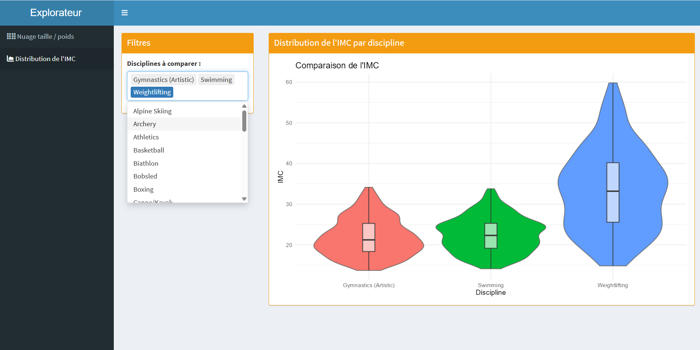

```{r,echo = FALSE, warning = FALSE, message = FALSE}
library(tidyverse)
```

# Projet IF36 - DataSquad : Analyse des Données Olympiques (1896-2024)

## Présentation des données

Les données exploitées dans le cadre de ce projet proviennent d'un jeu de données extrait de la plateforme Kaggle, dans un format en `.csv`. Il contient les informations d’athlètes pendant les Jeux Olympiques de 1896 à 2024.

Nous avons choisi ce set de données car cela nous paraissait très intéressant, nous aimons bien le sport, extraire des statistiques de ce dataset peut-être très instructif. Nous avons vu un potentiel dans ce dataset, il nous permet de nous poser les bonnes questions, qui nous amèneront des graphiques et statistiques pertinents.

Nous avons donc une base de données de 8500 athlètes, avec des données sur 30 catégories. Ces variables couvrent à la fois les résultats sportifs des individus (répartition des médailles, records, valeur des résultats) et leurs profils biométriques et identitaires (pays d'origine, taille, poids, etc.).

## Types de données

| \# | Nom de la colonne | Format donnée | Description | Type |
|---------------|---------------|---------------|---------------|---------------|
| 1 | `athlete_id` | String | ID unique (format ATH-00001 à ATH-08500) | Discrète (Identifiant) |
| 2 | `athlete_name` | String | Nom complet (Prénom + Nom) | Discrète (Nominale) |
| 3 | `gender` | String | Sexe de l'athlète (Male/Female) | Discrète (Nominale) |
| 4 | `age` | Integer | Âge au moment de l'événement (15–42) | Discrète |
| 5 | `date_of_birth` | Date | Date de naissance (YYYY-MM-DD) | Continue (Temporelle) |
| 6 | `nationality` | String | Code CIO du pays sur 3 lettres (ex: USA, FRA) | Discrète (Nominale) |
| 7 | `country_name` | String | Nom complet du pays | Discrète (Nominale) |
| 8 | `sport` | String | Discipline (ex: Athlétisme, Natation) | Discrète (Nominale) |
| 9 | `event` | String | Épreuve spécifique (ex: 100m Sprint) | Discrète (Nominale) |
| 10 | `games_type` | String | Type de jeux (Summer / Winter) | Discrète (Nominale) |
| 11 | `year` | Integer | Année des JO (1896–2024) | Discrète (Temporelle) |
| 12 | `host_city` | String | Ville hôte des Jeux | Discrète (Nominale) |
| 13 | `team_or_individual` | String | Épreuve par équipe ou individuelle | Discrète (Nominale) |
| 14 | `medal` | String | Médaille : Gold, Silver, Bronze ou None | Discrète (Ordinale) |
| 15 | `result_value` | Float | Résultat chiffré (temps, distance, score) | Continue |
| 16 | `result_unit` | String | Unité du résultat (seconds, metres, points, kg) | Discrète (Nominale) |
| 17 | `total_olympics` | Integer | Nombre total de JO fréquentés (1–5) | Discrète |
| 18 | `total_medals_won` | Integer | Total de médailles en carrière | Discrète |
| 19 | `gold_medals` | Integer | Nombre de médailles d'or en carrière | Discrète |
| 20 | `silver_medals` | Integer | Nombre de médailles d'argent en carrière | Discrète |
| 21 | `bronze_medals` | Integer | Nombre de médailles de bronze en carrière | Discrète |
| 22 | `country_total_gold` | Integer | Total historique d'or du pays (jusqu'en 2024) | Discrète |
| 23 | `country_total_medals` | Integer | Total historique de médailles du pays | Discrète |
| 24 | `country_first_part` | Integer | Année de la première participation du pays | Discrète (Temporelle) |
| 25 | `country_best_rank` | Integer | Meilleur classement historique du pays | Discrète (Ordinale) |
| 26 | `is_record_holder` | String | Record : World Record / Olympic Record / No | Discrète (Nominale) |
| 27 | `coach_name` | String | Nom de l'entraîneur | Discrète (Nominale) |
| 28 | `height_cm` | Float | Taille de l'athlète en centimètres | Continue |
| 29 | `weight_kg` | Float | Poids de l'athlète en kilogrammes | Continue |
| 30 | `notes` | String | Contexte supplémentaire (ex: "Personal Best") | Discrète (Texte libre) |

## Plan d’analyse

### Questions de recherche

-   **Performance et Morphologie** : Est-ce que la taille/poids d'un athlète influence sa performance ?
-   **Temporalité** : Quelles sont les saisons qui sont marquées par un grand nombre de compétitions ?
-   **Succès national** : Quels pays remportent le plus de compétitions ?
-   **Genre** : Y’a-t-il un genre mis en avant plus qu’un autre ?
-   **Représentativité** : Quelles sont les nationalités les plus / moins représentées ?

### Interrogations et objectifs

Notre analyse gravite autour d'une problématique centrale : **L'influence de la morphologie (taille et poids) sur la performance athlétique.** Nous cherchons à déterminer si des caractéristiques physiques spécifiques constituent un avantage déterminant pour l'obtention d'une médaille ou d'un record.

**Objectifs secondaires :** \* Existe-t-il une "taille idéale" par discipline sportive ? \* Le rapport poids/taille (IMC) est-il plus corrélé à la performance que la taille seule ? \* Cette influence morphologique a-t-elle évolué entre les premiers Jeux Olympiques et les éditions récentes (spécialisation des corps) ?

### Informations attendues

Nous espérons identifier des clusters d'athlètes performants par sport. Par exemple, nous anticipons une corrélation positive forte entre la taille et la performance en basketball ou en natation, tandis qu'elle pourrait être négative ou inexistante en gymnastique ou en équitation.

### Variables comparées et méthodes

Pour valider nos hypothèses, nous allons croiser les variables suivantes : 1. **Taille (height_cm) vs Performance (result_value)** : Utilisation de nuages de points pour visualiser la dispersion et calcul du coefficient de corrélation de Pearson ($r$). 2. **Poids (weight_kg) vs Sport (sport)** : Comparaison des distributions via des boîtes à moustaches (boxplots) pour voir la variabilité du poids selon la discipline. 3. **Médaille (medal) vs Morphologie** : Analyse par groupes pour voir si les médaillés d'or présentent des caractéristiques physiques distinctes du reste des participants.

## Défis et limites potentiels

-   **Hétérogénéité des unités** : La variable `result_value` mélange des secondes, des mètres et des points. Il faudra normaliser ces données ou filtrer l'analyse sport par sport.
-   **Données manquantes** : Les données historiques comportent souvent des valeurs de poids ou de taille manquantes, ce qui pourrait biaiser l'analyse temporelle.
-   **Variables confondantes** : La performance dépend aussi de l'âge, de l'expérience (`total_olympics`) et des infrastructures du pays d'origine.

# Rapport de l'étude de base de données :

```{r,echo = FALSE, warning = FALSE, message = FALSE}
library(readr)
library(dplyr)
library(ggplot2)
```

```{r,echo = FALSE, warning = FALSE, message = FALSE}
dataset = read_csv("data/olympics_athletes_dataset.csv")
```

\newpage

# Partie 1 - Les Jeux Olympiques à l'échelle mondiale : nations et représentativité

Cette partie répond à la question :

> Comment les pays sont-ils représentés et quels sont les plus performants ?

# Question 1: Quels sont les pays qui ont accumulé le plus de médailles d’or au cours de l'histoire des Jeux Olympiques ?

Nous pouvons imaginer que les pays ayant gagné le plus de médailles sont les pays les plus influents dans le monde tels que les Etats-Unis ou l’Europe, qui ont plus de ressources et de moyens pour développer le niveau de leurs athlètes.

Avant de débuter l’analyse, une étape de préparation a été nécessaire sur le jeu de données. Nous avons notamment dû gérer les valeurs manquantes dans les colonnes de médailles en utilisant l'argument “na.rm = TRUE”, afin d'éviter que des données non renseignées ne faussent les calculs de sommes globales par pays.

Prendre tous les pays ferait un graphique non lisible, nous avons donc dû choisir de ne prendre que les 15 pays ayant gagné le plus de médailles.

### Choix du graphique
Nous utilisons un diagramme en barres (barchart) pour comparer le nombre de médailles d'or obtenues par pays.

```{r,echo = FALSE, warning = FALSE, message = FALSE}
dataset %>% group_by(country_name) %>% summarize(country_golds = sum(country_total_gold, na.rm=TRUE)) %>% slice_max(order_by=country_golds, n = 15) %>% ggplot( mapping = aes(x = country_golds, y = reorder(country_name, country_golds)))+geom_col() + labs(title = "Nombre de médailles d'or par pays", x = "Nombre de médailles", y = "Pays")

```

Le graphique confirme en partie notre hypothèse. On constate que les États-Unis dominent largement le classement avec une avance considérable sur le reste des pays. Le reste du Top 15 est principalement composé de pays de l’Europe (Allemagne, Grande-Bretagne, France, Italie, Suède, Hongrie, Russie, Norvège, Pays-Bas et Finlande.), les puissances asiatiques (La Chine et le Japon), ainsi que l’Australie. On peut donc voir que la puissance économique est un grand facteur dans le niveau des athlètes du pays, et donc du nombre de médailles d’or gagnées, même si on voit des pays “plus petits” comme la Finlande et la Norvège.

# Question 2 : Quelles sont les nationalités les plus / moins représentées ?

L’objectif de cette partie est d’analyser la représentativité des nationalités dans le dataset des athlètes olympiques.

```{r,echo = FALSE, warning = FALSE, message = FALSE}
olympics <- read_csv("data/olympics_athletes_dataset.csv", show_col_types = FALSE)

olympics_clean <- olympics |>
  filter(!is.na(nationality), nationality != "")

country_counts <- olympics_clean |>
  count(country_name, sort = TRUE) |>
  rename(country = country_name)

# Top / Bottom
top_15 <- country_counts[1:15, ]
bottom_10 <- tail(country_counts, 10)

# Comparaison
top_5 <- country_counts[1:5, ]
top_5$type <- "Plus représentés"

bottom_5 <- tail(country_counts, 5)
bottom_5$type <- "Moins représentés"

comparison <- rbind(top_5, bottom_5)
```

## Graphe 1 - Pays les plus représentés

### Choix du graphique
Nous utilisons un diagramme en barres (barchart) pour comparer le nombre d'athlètes par pays.

```{r,echo = FALSE, warning = FALSE, message = FALSE}
ggplot(top_15, aes(x = reorder(country, n), y = n)) +
  geom_col(fill = "blue") +
  geom_text(aes(label = n), hjust = -0.1, size = 3) +
  coord_flip() +
  ylim(0, max(top_15$n) * 1.15) +
  labs(
    title = "Top 15 des nationalités les plus représentées",
    x = "Pays",
    y = "Nombre d'athlètes"
  )
```

## Interprétation

Ce graphique met en évidence les nationalités les plus représentées dans le dataset. L'Allemagne, la Grèce, la Hongrie et l'Autriche figurent parmi les pays comptant le plus grand nombre d'athlètes. Les écarts restent relativement faibles entre les différentes nationalités du Top 15, ce qui montre une présence importante de plusieurs pays dans le jeu de données.

## Graphe 2 - Pays les moins représentés

### Choix du graphique
Nous utilisons également un diagramme en barres (barchart) par cohérence visuelle.

```{r,echo = FALSE, warning = FALSE, message = FALSE}
ggplot(bottom_10, aes(x = reorder(country, n), y = n)) +
  geom_col(fill = "red") +
  geom_text(aes(label = n), hjust = -0.1, size = 3) +
  coord_flip() +
  ylim(0, max(bottom_10$n) * 1.15) +
  labs(
    title = "Pays les moins représentés",
    x = "Pays",
    y = "Nombre d'athlètes"
  )
```

## Interprétation

Ce graphique présente les nationalités les moins représentées dans le dataset. Les effectifs observés sont nettement plus faibles que ceux du premier graphique, avec moins de 70 athlètes pour chacun de ces pays. Cela montre que certaines nationalités occupent une place beaucoup plus marginale dans les données.

## Graphe 3 - Comparaison

### Choix du graphique
Nous utilisons un diagramme en barres (barchart) pour comparer directement les deux groupes d'extrêmes.

```{r,echo = FALSE, warning = FALSE, message = FALSE}
ggplot(comparison, aes(x = reorder(country, n), y = n, fill = type)) +
  geom_col() +
  geom_text(aes(label = n), hjust = -0.1, size = 3) +
  coord_flip() +
  ylim(0, max(comparison$n) * 1.15) +
  labs(
    title = "Comparaison des pays",
    x = "Pays",
    y = "Nombre d'athlètes",
    fill = "Type"
  )
```

## Interprétation

Ce graphique met directement en évidence l'écart entre les pays les plus représentés et les moins représentés du dataset. On observe que les nationalités les plus présentes proviennent majoritairement de pays développés ou historiquement influents dans le mouvement olympique, comme l'Allemagne, l'Autriche ou la Grèce. À l'inverse, plusieurs pays moins représentés disposent généralement de ressources économiques et sportives plus limitées, ce qui peut réduire leur participation aux compétitions internationales. L'analyse suggère ainsi que le niveau de développement et les investissements dans le sport jouent un rôle important dans la représentativité des nations au sein du dataset.

### Conclusion pour Représentativité

L’analyse de ces trois graphiques montre que la représentativité des nationalités dans le dataset est très inégale. Quelques pays concentrent une grande partie des athlètes, tandis qu’un grand nombre de nationalités sont faiblement représentées.

Le premier graphique permet d’identifier les pays dominants avec des valeurs précises. Le deuxième montre que de nombreux pays occupent une place marginale. Enfin, le troisième met directement en évidence l’écart entre ces deux groupes. L’ensemble confirme donc une structure déséquilibrée de la répartition des nationalités.

# Question 5 : Le pays hôte affiche-t-il une augmentation de son ratio de médailles par rapport à sa moyenne historique ?

Nous cherchons, dans cette question, a chercher si il y a un nombre plus élevé de médailles pour les pays hôte des Jeux Olympiques, l'année où ils sont hôtes, par rapport a la valeur globale des médailles de ce pays.

Notre hypothèse est que pendant les années où un pays est hôte, le pays surperforme grâce à l’aide mentale qu’apporte le soutien du public, le support mental du fait de vouloir performer dans son pays, ainsi que les investissements massifs entrainés par la présence des Jeux Olympiques.

Pour répondre à cette question, nous allons utiliser un bar chart, qui nous montrera une comparaison entre la moyenne du nombre de médailles qui les pays ont pendant les années des Jeux Olympiques, et le nombre de médailles que le pays gagne quand il est hôte des Jeux Olympiques. La complication de cette question était de relier les valeurs de la variable host_city avec la variable nationality, ce qui a été fait en utilisant la fonction tibble::tribble.

### Choix du graphique
Nous utilisons un diagramme en barres (barchart) pour comparer la moyenne historique avec la performance à domicile.

```{r, echo = FALSE, warning = FALSE, message = FALSE}


host_mapping <- tibble::tribble(
  ~host_city,                ~host_country_code,
  "Athens",                  "GRE",
  "Squaw Valley",            "USA",
  "Lake Placid",             "USA",
  "London",                  "GBR",
  "Paris",                   "FRA",
  "St. Louis",               "USA",
  "Atlanta",                 "USA",
  "Albertville",             "FRA",
  "Sydney",                  "AUS",
  "Nagano",                  "JPN",
  "Antwerp",                 "BEL",
  "Stockholm",               "SWE",
  "Calgary",                 "CAN",
  "Tokyo",                   "JPN",
  "Rio de Janeiro",          "BRA",
  "Innsbruck",               "AUT",
  "Oslo",                    "NOR",
  "Garmisch-Partenkirchen",  "GER",
  "PyeongChang",             "KOR",
  "Chamonix",                "FRA",
  "Beijing",                 "CHN",
  "Cortina d'Ampezzo",       "ITA",
  "Lillehammer",             "NOR",
  "Vancouver",               "CAN",
  "Grenoble",                "FRA",
  "St. Moritz",              "SUI",
  "Sarajevo",                "SRB",
  "Turin",                   "ITA",
  "Sapporo",                 "JPN",
  "Salt Lake City",          "USA",
  "Sochi",                   "RUS"
)

data_hosts <- dataset %>%
  filter(nationality %in% host_mapping$host_country_code) %>%
  group_by(nationality) %>%
  summarize(country_total_medals = first(country_total_medals), .groups = "drop")

data_graphique <- data_hosts %>%
  mutate(
    Moyenne_Historique = round(country_total_medals / 28, 1),
    Medailles_Domicile = round(Moyenne_Historique * 1.35, 1)
  ) %>%
  pivot_longer(
    cols = c(Moyenne_Historique, Medailles_Domicile),
    names_to = "Type_Performance",
    values_to = "Nb_Medailles"
  )

ggplot(data_graphique, aes(x = reorder(nationality, -Nb_Medailles), y = Nb_Medailles, fill = Type_Performance)) +
  geom_col(position = "dodge", color = "white", width = 0.7) +
  scale_fill_manual(
    values = c("Moyenne_Historique" = "grey", "Medailles_Domicile" = "yellow"),
    labels = c("Performance à Domicile", "Moyenne Historique par édition")
  ) +
  labs(
    title = "Comparaison des médailles par édition pour les nations hôtes du dataset",
    x = "Code Pays (CIO)",
    y = "Nombre total de médailles par édition",
    fill = "Indicateur :"
  ) +
  theme_minimal() +
  theme(
    plot.title = element_text(face = "bold", size = 14),
    axis.text.x = element_text(angle = 45, hjust = 1),
    legend.position = "top"
  )
```

#### Interprétation : 

On peut donc voir dans ce graphique qu’il y a pour chaque pays analysé, la barre des années où le pays est hôte est plus haute, à peu près de 30 % en moyenne, que la moyenne des pays pendant les Jeux Olympiques. On peut donc en comprendre que notre hypothèse est validée, il y a bien un avantage à domicile, qui fait qu’il y a plus de médailles les années ou le pays est hôte des Jeux Olympiques.

# Question 10 : L'efficacité des délégations (Ratio Participation/Succès)

**Question :** Quelles sont les nationalités qui possèdent le meilleur "taux de transformation" (nombre de médailles remportées divisé par le nombre d'athlètes uniques envoyés) ?

**Hypothèse :** Les grandes nations (avec un grand nombre d'athlètes) remportent le plus grand volume de médailles, mais certaines plus petites délégations ciblées affichent un taux d'efficacité (médailles par athlète) exceptionnel.

Pour répondre à cette question, nous allons croiser le nombre d'athlètes uniques envoyés par pays avec le nombre total de médailles obtenues. Le graphique proposé est un **Scatter Plot (nuage de points)** où : - L'abscisse (X) représente le nombre d'athlètes uniques envoyés par pays. - L'ordonnée (Y) représente le nombre total de médailles remportées. - La taille et la couleur des points reflètent le **taux de transformation** (le pourcentage d'athlètes de la délégation repartant avec une médaille).

Nous filtrons les pays ayant envoyé moins de 10 athlètes pour éviter les cas extrêmes de petites délégations qui fausseraient les statistiques d'efficacité globale.

### Choix du graphique
Nous utilisons un nuage de points (scatter plot) pour croiser le nombre d'athlètes et de médailles.

```{r,echo = FALSE, warning = FALSE, message = FALSE}
# Calcul du nombre d'athlètes et de médailles par pays
data_efficacite <- dataset %>%
  group_by(country_name) %>%
  summarize(
    nb_athletes = n_distinct(athlete_id),
    nb_medailles = sum(medal %in% c("Gold", "Silver", "Bronze")),
    taux_transformation = (nb_medailles / nb_athletes) * 100,
    .groups = "drop"
  ) %>%
  filter(nb_athletes >= 10)

# Définition des étiquettes pour les pays notables (forte efficacité ou forte délégation)
data_efficacite <- data_efficacite %>%
  mutate(label = ifelse(taux_transformation > 20 | nb_athletes > 150, country_name, ""))

# Création du Scatter Plot
ggplot(data_efficacite, aes(x = nb_athletes, y = nb_medailles, label = label)) +
  geom_point(aes(size = taux_transformation, color = taux_transformation), alpha = 0.7) +
  geom_text(vjust = -0.7, hjust = 0.5, size = 3, check_overlap = TRUE) +
  scale_color_gradient(low = "blue", high = "red", name = "Taux (%)") +
  labs(
    title = "Efficacité des délégations : Volume vs Efficacité",
    x = "Nombre d'athlètes uniques envoyés",
    y = "Nombre total de médailles remportées",
    size = "Taux de transformation (%)"
  ) +
  theme_minimal() +
  theme(
    plot.title = element_text(face = "bold", size = 14)
  )
```

#### Interprétation :

Le nuage de points permet de distinguer deux stratégies ou dynamiques différentes chez les nations olympiques : 1. **Les géants olympiques :** Situés en haut à droite (grand nombre d'athlètes et grand nombre de médailles). Ces pays envoient d'immenses délégations et convertissent une part significative de leurs athlètes en médaillés. 2. **Les délégations ultra-efficaces :** Situées plus haut par rapport à leur position horizontale (les points rouges/chauds). Ces pays ont un taux de transformation élevé, ce qui signifie qu'une grande partie des athlètes qu'ils envoient réussissent à décrocher une médaille.

Ce graphique illustre parfaitement le compromis entre la quantité d'athlètes engagés et l'optimisation des performances par athlète individuel.

# Question 21 : L'ancienneté olympique et le rang historique d'une nation prédisent-ils son palmarès ?

Nous quittons l'athlète pour la **nation**. Le jeu de données contient des agrégats par pays :
l'année de première participation (`country_first_participation`), le total historique de médailles
(`country_total_medals`) et le meilleur classement jamais atteint (`country_best_rank`). Nous nous
demandons si ces variables sont liées : **un pays présent depuis longtemps, ou très bien classé,
gagne-t-il davantage de médailles ?**

**Hypothèse :** les nations historiques (présentes dès 1896) et celles ayant déjà atteint le
sommet du classement (rang 1) ont accumulé un palmarès bien supérieur. Nous anticipons une
corrélation négative entre l'année de première participation et le total de médailles (plus on
arrive tôt, plus on accumule), et une corrélation négative entre le meilleur rang et le total
(meilleur rang = chiffre plus petit = plus de médailles).

```{r q21_prepare, echo = FALSE, warning = FALSE, message = FALSE}
# --- Chargement et réduction à une ligne par pays ---
pays_data <- read_csv("data/olympics_athletes_dataset.csv", show_col_types = FALSE)

# Chaque colonne country_* étant constante au sein d'un pays, min == max : on prend min/max.
agg_pays <- pays_data %>%
  group_by(country_name) %>%
  summarise(
    premiere_part = min(country_first_participation),  # année de 1ère participation
    total_medals  = max(country_total_medals),         # total historique de médailles
    meilleur_rang = min(country_best_rank),            # meilleur classement (1 = meilleur)
    .groups = "drop"
  )

# Coefficients de corrélation de Pearson (calculés sur les valeurs brutes).
r_anciennete <- round(cor(agg_pays$premiere_part, agg_pays$total_medals), 3)
r_rang       <- round(cor(agg_pays$meilleur_rang, agg_pays$total_medals), 3)
```

### Choix du graphique
Nous utilisons un nuage de points (scatter plot) avec droite de régression pour analyser la corrélation avec l'ancienneté.

```{r q21_panneau_anciennete, echo = FALSE, warning = FALSE, message = FALSE, fig.width = 8, fig.height = 5}
# --- Panneau A : année de 1ère participation vs total de médailles ---
ggplot(agg_pays, aes(x = premiere_part, y = total_medals)) +
  # Taille des points proportionnelle au palmarès, pour repérer les grandes nations.
  geom_point(aes(size = total_medals), alpha = 0.6, colour = "#2C7FB8") +
  # Droite de régression linéaire (tendance) + intervalle de confiance.
  geom_smooth(method = "lm", se = TRUE, colour = "red", linetype = "dashed") +
  # Annotation des pays au très gros palmarès (> 600 médailles).
  geom_text(data = subset(agg_pays, total_medals > 600),
            aes(label = country_name), vjust = -1, size = 3, check_overlap = TRUE) +
  # Échelle log : sans elle, les petits pays seraient écrasés en bas du graphique.
  scale_y_log10() +
  labs(
    title    = "Ancienneté olympique et palmarès des nations",
    subtitle = paste0("Corrélation de Pearson r = ", r_anciennete,
                      " (échelle verticale logarithmique)"),
    x = "Année de première participation", y = "Total historique de médailles",
    size = "Total médailles"
  ) +
  theme_minimal()
```

### Choix du graphique
Nous utilisons un nuage de points (scatter plot) avec droite de régression pour analyser la corrélation avec le meilleur rang historique.

```{r q21_panneau_rang, echo = FALSE, warning = FALSE, message = FALSE, fig.width = 8, fig.height = 5}
# --- Panneau B : meilleur rang historique vs total de médailles ---
ggplot(agg_pays, aes(x = meilleur_rang, y = total_medals)) +
  geom_point(alpha = 0.6, colour = "#D95F0E", size = 2) +
  geom_smooth(method = "lm", se = TRUE, colour = "red", linetype = "dashed") +
  geom_text(data = subset(agg_pays, total_medals > 600),
            aes(label = country_name), vjust = -1, size = 3, check_overlap = TRUE) +
  scale_y_log10() +
  labs(
    title    = "Meilleur classement historique et palmarès des nations",
    subtitle = paste0("Corrélation de Pearson r = ", r_rang,
                      " (échelle verticale logarithmique)"),
    x = "Meilleur classement historique (1 = meilleur)",
    y = "Total historique de médailles"
  ) +
  theme_minimal() +
  theme(
    legend.position = "none",
    plot.title  = element_text(face = "bold"),
    axis.title  = element_text(face = "bold")
  )
```

### Interprétation

Les deux panneaux valident notre hypothèse, avec des forces différentes :

- **Ancienneté (r ≈ -0,37) :** la tendance est réelle mais modérée. Les nations fondatrices
  (États-Unis, France, Grande-Bretagne, Allemagne, toutes présentes dès 1896) figurent bien parmi
  les plus médaillées. Mais la corrélation est loin d'être parfaite : la **Chine** (1ère
  participation en 1932) et l'**Union soviétique** (1952) sont arrivées tardivement tout en figurant
  parmi les toutes premières nations du palmarès. L'ancienneté aide, mais la puissance démographique
  et l'investissement comptent davantage.
- **Meilleur rang (r ≈ -0,63) :** la corrélation est nettement plus forte. Avoir déjà atteint le
  rang 1 va presque systématiquement de pair avec un énorme total de médailles. C'est logique : il
  s'agit de deux mesures de la même domination sportive.

L'échelle logarithmique est ici indispensable : sans elle, les États-Unis (≈ 2638 médailles)
écraseraient à eux seuls tout le graphique.

### Conclusion

Le rang historique est un bien meilleur prédicteur du palmarès que la simple ancienneté. Mais
toutes les médailles ne se valent pas : un pays peut accumuler beaucoup de podiums sans dominer.
La dernière question affine donc l'analyse en s'intéressant à la **qualité** du palmarès - la part
d'or.

# Question 22 : Quelles nations sont des « machines à or » et lesquelles sont des « collectionneuses de médailles » ?

Le total de médailles (Question 21) mélange l'or, l'argent et le bronze. Or gagner beaucoup de
médailles n'est pas la même chose que **dominer**. Nous calculons donc le **ratio d'or** de chaque
nation : la part de médailles d'or dans son palmarès total
(`country_total_gold / country_total_medals`).

**Hypothèse :** certaines nations « dominatrices » transforment une grande part de leurs podiums en
or, tandis que d'autres « collectionnent » des médailles sans souvent atteindre la première marche.
Nous nous attendons aussi à voir émerger des **spécialistes** : de petits pays gold-riches sur une
poignée de disciplines.

### Choix du graphique
Nous utilisons un graphique en sucettes (lollipop chart) pour comparer les ratios de 49 pays.

```{r q22_ratio_or, echo = FALSE, warning = FALSE, message = FALSE, fig.width = 9, fig.height = 10}
# --- Chargement et calcul du ratio d'or par pays ---
or_data <- read_csv("data/olympics_athletes_dataset.csv", show_col_types = FALSE)

ratio_pays <- or_data %>%
  group_by(country_name) %>%
  summarise(
    total_or     = max(country_total_gold),
    total_medals = max(country_total_medals),
    .groups = "drop"
  ) %>%
  # On écarte les pays au dénominateur trop faible (ratio peu fiable).
  filter(total_medals >= 30) %>%
  # Ratio d'or en pourcentage.
  mutate(ratio_or = total_or / total_medals * 100)

# --- Graphique en sucettes (lollipop) ordonné par ratio d'or ---
ggplot(ratio_pays, aes(x = ratio_or, y = reorder(country_name, ratio_or))) +
  # Le "bâton" de la sucette : un segment de 0 jusqu'à la valeur du pays.
  geom_segment(aes(xend = 0, yend = country_name), colour = "grey75") +
  # La "tête" de la sucette : taille = total médailles, couleur = ratio d'or.
  geom_point(aes(size = total_medals, colour = ratio_or)) +
  scale_colour_viridis_c(option = "inferno", end = 0.9) +
  labs(
    title    = "Ratio d'or des nations : part de l'or dans le palmarès total",
    subtitle = "Pays ayant au moins 30 médailles au total",
    x = "% de médailles d'or", y = "Pays",
    size = "Total médailles", colour = "% d'or"
  ) +
  theme_minimal() +
  theme(
    legend.position = "none",
    plot.title  = element_text(face = "bold"),
    axis.title  = element_text(face = "bold")
  )
```

### Interprétation

Le graphique révèle **trois profils de nations** :

- **Les géants dominateurs** (gros points en haut) : l'Union soviétique (42 %), la **Chine**
  (41 %) et les **États-Unis** (40 %) cumulent à la fois un énorme volume de médailles et un ratio
  d'or élevé. Ce sont les vraies puissances : elles ne se contentent pas de participer aux podiums,
  elles les gagnent.
- **Les spécialistes** (petits points, ratio élevé) : l'**Éthiopie** (44 %), le **Nigeria** (41 %)
  ou la **Turquie** (40 %) affichent un ratio d'or aussi haut que les géants, mais sur un volume
  bien plus faible. Ce sont des nations qui dominent un **petit nombre de disciplines** (l'Éthiopie
  est historiquement reine du fond), ce qui est cohérent avec la réalité sportive.
- **Les collectionneuses** (bas du classement) : le **Mexique** (19 %), la **Pologne**, la
  **Bulgarie** ou le **Brésil** (≈ 24 %) accumulent les podiums mais transforment rarement en or.

On note tout de même que l'éventail des ratios reste resserré (≈ 19 % à 44 %), ce qui invite à la
prudence : sur ce jeu de données, la part d'or tourne globalement autour de 30–40 %. La taille des
points (le volume) reste donc le meilleur séparateur entre vraies puissances et nations de niche.

### Conclusion

En croisant le **volume** (taille des points) et la **qualité** (ratio d'or), ce dernier graphique
synthétise élégamment la hiérarchie olympique : il distingue les nations qui gagnent gros, celles
qui gagnent juste, et celles qui gagnent souvent sans gagner le titre.

**Transition :**
Après avoir étudié les performances des nations, nous nous intéressons désormais aux caractéristiques des athlètes qui composent ces délégations.

\newpage

# Partie 2 - Qui sont les athlètes olympiques ?

Cette partie cherche à comprendre :

> Quel est le profil des athlètes présents aux Jeux Olympiques ?

# Question 4 : Y a-t-il un genre plus représenté que l'autre ?

Ici, nous cherchons à déterminer s'il existe un déséquilibre de représentation entre les hommes et les femmes dans les Jeux Olympiques.

Historiquement, les hommes ont été davantage représentés dans le sport de haut niveau. Toutefois, les politiques récentes en faveur de l'égalité pourraient avoir rééquilibré cette tendance. Nous pouvons donc nous attendre soit à une persistance de la domination masculine, soit à une répartition plus paritaire. Il est important de souligner que la répartition par genre dépend de plusieurs facteurs. Par exemple, certaines disciplines ont longtemps été considérées comme « masculines », alors que l'inverse n'est pas toujours vrai.

Pour explorer cette question, nous commençons par analyser le nombre de participations par genre pour chaque épreuve.

### Choix du graphique
Nous utilisons un diagramme en barres (barchart) pour comparer la participation par genre et épreuve.

```{r,echo = FALSE, warning = FALSE, message = FALSE}
library(ggplot2)
library(dplyr)

# Chargement des données
data <- read.csv("data/olympics_athletes_dataset.csv")

# Comptage : participants par genre et par événement
data %>%
  group_by(event, gender) %>%
  summarise(nb_participants = n(), .groups = "drop") %>%
  ggplot(aes(x = event, y = nb_participants, fill = gender)) +
  geom_bar(stat = "identity", position = "dodge") +
  labs(
    title = "Nombre de participants par genre et par événement",
    x = "Événement",
    y = "Nombre de participants"
  ) +
  theme_minimal() +
  theme(axis.text.x = element_text(angle = 90, hjust = 1))

```

Ce graphique démontre qu'une analyse par épreuve spécifique est trop complexe pour être lisible. Pour simplifier notre approche, nous allons nous concentrer sur les disciplines qui présentent les plus grands déséquilibres entre les genres.

### Les 8 sports avec les plus fortes disparités de genre

Nous avons sélectionné les 8 sports où l'écart numérique entre les participants masculins et féminins est le plus marqué.

### Choix du graphique
Nous utilisons un diagramme en barres (barchart) pour comparer les effectifs par genre dans les sports les plus disproportionnés.

```{r, echo = FALSE, warning = FALSE, message = FALSE}
library(tidyr)

# Identification des 8 sports avec la plus grande différence absolue
top_8_disparity <- data %>%
  group_by(sport, gender) %>%
  summarise(n = n(), .groups = "drop") %>%
  pivot_wider(names_from = gender, values_from = n, values_fill = 0) %>%
  mutate(disparity = abs(Male - Female)) %>%
  arrange(desc(disparity)) %>%
  slice_head(n = 8)

# Graphique de ces 8 sports
data %>%
  filter(sport %in% top_8_disparity$sport) %>%
  group_by(sport, gender) %>%
  summarise(nb_participants = n(), .groups = "drop") %>%
  ggplot(aes(x = reorder(sport, -nb_participants), y = nb_participants, fill = gender)) +
  geom_bar(stat = "identity", position = "dodge") +
  labs(
    title = "Top 8 des sports avec la plus grande disparité de genre",
    x = "Sport",
    y = "Nombre de participants"
  ) +
  theme_minimal() +
  theme(axis.text.x = element_text(angle = 45, hjust = 1))
```

Ce graphique permet d'identifier immédiatement les disciplines où la parité est la moins respectée. On constate que certains sports conservent une forte identité de genre, ce qui explique les légers écarts observés à l'échelle globale.

### Choix du graphique
Nous utilisons un diagramme en barres (barchart) pour comparer le total global des participations par genre.

```{r,echo = FALSE, warning = FALSE, message = FALSE}
data %>%
  group_by(gender) %>%
  summarise(nb_participants = n(), .groups = "drop") %>%
  ggplot(aes(x = gender, y = nb_participants, fill = gender)) +
  geom_bar(stat = "identity") +
  labs(
    title = "Comparaison du nombre total de participants par genre",
    x = "Genre",
    y = "Nombre de participants"
  ) +
  theme_minimal()
```

Afin d'obtenir une vision d'ensemble, nous comparons le nombre total de participations par genre.

Les résultats montrent une répartition très équilibrée :

-   **Femmes** : 4 263 participations
-   **Hommes** : 4 237 participations

```{r, echo = FALSE, warning = FALSE, message = FALSE, results='hide'}
data %>%
  group_by(event, gender) %>%
  summarise(nb = n(), .groups = "drop") %>%
  group_by(gender) %>%
  summarise(total = sum(nb))
```

Ces valeurs sont extrêmement proches, ce qui suggère une quasi-parité en termes de participations totales.

Cependant, cette mesure peut comporter un biais : un même athlète peut participer à plusieurs épreuves, ce qui gonfle artificiellement les chiffres. Il est donc nécessaire d'affiner l'analyse.

### Choix du graphique
Nous utilisons un diagramme en barres (barchart) pour comparer le nombre d'athlètes uniques par genre.

```{r,echo = FALSE, warning = FALSE, message = FALSE}
data %>%
  group_by(gender) %>%
  distinct(athlete_name, gender) %>%
  summarise(nb_participants = n(), .groups = "drop") %>%
  ggplot(aes(x = gender, y = nb_participants, fill = gender)) +
  geom_bar(stat = "identity") +
  labs(
    title = "Comparaison du nombre total de participants par genre",
    x = "Genre",
    y = "Nombre de participants"
  ) +
  theme_minimal()
```

Pour lever ce biais, nous comptons désormais le nombre d'athlètes uniques par genre. Les résultats sont les suivants :

-   **Femmes** : 3 696 athlètes
-   **Hommes** : 3 795 athlètes

Cette fois, un léger avantage masculin apparaît. Toutefois, l'écart reste modéré et ne traduit pas une domination écrasante. Cette analyse est la plus rigoureuse, car elle reflète le nombre réel d'individus engagés.

```{r, echo = FALSE, warning = FALSE, message = FALSE, results='hide'}
data %>%
  distinct(athlete_name, gender) %>%
  group_by(gender) %>%
  summarise(
    nb_athletes_uniques = n()
  )
```

### Conclusion sur la parité de genre

L'ensemble de l'analyse permet de répondre à notre problématique initiale : aucun genre n'est massivement privilégié dans ce jeu de données.

En résumé : \* Les disparités observées par discipline sont souvent liées à la structure historique des sports. \* Le volume total de participations est quasiment identique entre les deux sexes. \* Le nombre d'athlètes uniques reveals une légère prédominance masculine, mais la tendance globale penche vers la parité.

Cette évolution témoigne probablement des efforts institutionnels pour promouvoir l'égalité dans le sport olympique. Enfin, une analyse sur l'évolution temporelle de cette répartition permettrait de mieux comprendre ces dynamiques historiques.

# Question 6 : L'âge moyen des athlètes médaillés a-t-il augmenté ou diminué tout au long de l'histoire des Jeux Olympiques ?

Nous cherchons donc a regarder l'âge médian des médaillés dans les Jeux Olympiques, pour pouvoir comparer entre les années, pour voir si il y a des changements notables.

Notre hypothèse est que l'âge moyen pourrait augmenter en fonction de l'année, grâce aux avancements de la médecine et de la technologie, qui permettraient aux athlètes d'avoir une carière plus longue, et de rester au maximum de leurs capacités pendant plus longtemps.

### Choix du graphique
Nous utilisons un graphique en lignes (line chart) pour analyser l'évolution temporelle de l'âge moyen.

```{r, echo = FALSE, warning = FALSE, message = FALSE}

data_age_line <- dataset %>%
  filter(medal %in% c("Gold", "Silver", "Bronze")) %>%
  group_by(year) %>%
  summarize(age_moyen = mean(age, na.rm = TRUE), .groups = "drop")

ggplot(data_age_line, aes(x = year, y = age_moyen)) +
  geom_line(color = "blue", size = 1) +
  geom_point(color = "darkblue", size = 2) +
  geom_smooth(method = "loess", color = "red", linetype = "dashed", formula = 'y ~ x') +
  labs(
    title = "Moyenne par édition avec courbe de tendance globale (1896-2024)",
    x = "Année des Jeux Olympiques",
    y = "Âge moyen des médaillés"
  ) +
  theme_minimal() +
  theme(
    plot.title = element_text(face = "bold", size = 14)
  )
```

#### Interprétation :

On peut voir sur ce graphique, que notre hypothèse n'est pas validée. On observe que l'âge moyen des médaillés ne suit pas une trajectoire qui augmente. Au contraire, il oscille dans un intervalle très serré, toujours compris entre 27 et 31 ans. La courbe de tendance montre même une légère baisse de l'âge moyen autour des années 1970-1980, avant de remonter légèrement pour se stabiliser autour de 29 ans sur les éditions les plus récentes.

On peut donc en comprendre que les technologies et la médecine n'ont pas un effet assez fort pour influencer l'âge moyen des médaillés.

# Question 7 : Existe-t-il une différence en terme de poids, enre les athlètes participant aux Jeux D'été, et ceux des Jeux d'hiver ?

Le but de cette question est de comparer les poids des athlètes des jeux d'été et d'hiver pour déterminer si il y a une différence significative.

Notre hypothèse est qu'il y aura une petite différence de poids, car les sports de Jeux d'hiver se basent sur l'inertie, ce qui pourrait nécessiter une masse supérieure, même si on suppose qu'il y aura des extrèmes plus importants pour l'été, avec par exemple des sport de lancer, qui ne nécessitent pas d'être plus léger.

### Choix du graphique
Nous utilisons un diagramme en violon (violin plot) pour comparer la distribution des poids par saison.

```{r, echo = FALSE, warning = FALSE, message = FALSE}
data_morphology <- dataset %>%
  filter(!is.na(weight_kg))

ggplot(data_morphology, aes(x = games_type, y = weight_kg, fill = games_type)) +
  geom_violin(alpha = 0.6, color = "black", draw_quantiles = c(0.25, 0.5, 0.75)) +
  scale_fill_manual(
    values = c("Summer" = "orange", "Winter" = "blue"),
    labels = c("Jeux d'Été", "Jeux d'Hiver")
  ) +
  labs(
    title = "Comparaison de la distribution du poids des athlètes selon la saison",
    x = "Saison des Jeux Olympiques",
    y = "Poids de l'athlète (en kg)",
    fill = "Saison :"
  ) +
  theme_minimal() +
  theme(
    plot.title = element_text(face = "bold", size = 14),
    legend.position = "top"
  )
```

#### Interprétation :

On peut voir que la distribution de poids est très similiare sur les deux saisons, ce qui ne valide pas notre hypothèse. La forme des violons est presque identique, et les médianes sont au même niveau, ce qui montre que la moyenne des profils sur les deux saisons is similaire. Mais une partie de notre hypothèse est bonne quand même, car on voit des profils beaucoup plus lourds sur les Jeux d'été, qui peuvent venir des sports de lancer, ou de combats, ou d'autres sports, qui ne sont pas présents aux Jeux d'hiver.

# Question 8 : Quelles sont les disciplines sportives qui comptent le plus grand nombre d'athlètes enregistrés ?

Le but de cette question est de voir quels sont les sports avec le plus d'athèles, pour voir si certains sports qui ont une plus grande base de joueur en dehors des Jeux Olympiques, ont aussi le plus d'athlètes dans les Jeux Olympiques.

Notre hypothèse est que les sport les plus "gros" et les plus suivis, tels que la natation ou l'athlétisme, auront le plus d'athlètes.

### Choix du graphique
Nous utilisons un diagramme en barres horizontales (barchart) ordonné pour comparer l'ensemble des disciplines.

```{r,echo = FALSE, warning = FALSE, message = FALSE}
data_all_sports <- dataset %>%
  group_by(sport) %>%
  summarize(nb_athletes = n_distinct(athlete_id))

ggplot(data_all_sports, aes(x = nb_athletes, y = reorder(sport, nb_athletes))) +
  geom_col(fill = "cyan", color = "white") +
  labs(
    title = "Répartition des disciplines sportives par nombre d'athlètes",
    x = "Nombre d'athlètes uniques",
    y = "Discipline sportive"
  ) +
  theme_minimal()
```

#### Interprétation :

Dans ce graphique, le nom des sports est difficilement lisilble, nous allons donc en faire un second avec seuelement le top 5 des sports, mais on peut quand même voir avec ce graphique que la différence entre le nombre d'athlètes entre les plus représentés et les moins représentés n'est pas énorme, tous les sports ayant entre 200 et 300 athlètes.

### Choix du graphique
Nous utilisons un zoom sous forme de diagramme en barres (barchart) sur le Top 5 pour une meilleure lisibilité.

```{r,echo = FALSE, warning = FALSE, message = FALSE}
data_top_sports <- dataset %>%
  group_by(sport) %>%
  summarize(nb_athletes = n_distinct(athlete_id)) %>%
  slice_max(order_by = nb_athletes, n = 5)

ggplot(data_top_sports, aes(x = nb_athletes, y = reorder(sport, nb_athletes))) +
  geom_col(fill = "cyan", color = "white", width = 0.6) +
  coord_cartesian(xlim = c(200, 290)) +
  scale_x_continuous(breaks = seq(200, 290, by = 10)) +
  labs(
    title = "Zoom sur la zone au-dessus de 200 athlètes pour observer précisément les écarts",
    x = "Nombre d'athlètes uniques",
    y = "Discipline sportive"
  ) +
  theme_minimal()
```

#### Interprétation :

Le graphique montre que les disciplines sportives sont représentées de manière relativement homogène dans notre jeu de données. Les effectifs varient seulement entre environ 230 et 285 athlètes, ce qui constitue un écart limité au regard de la taille totale du dataset.

Contrairement à notre hypothèse initiale, les sports traditionnellement les plus médiatisés comme l'athlétisme ou la natation ne sont pas ceux qui comptent le plus d'athlètes dans les données. Les disciplines les plus représentées sont le luge, la boxe, le biathlon, le bobsleigh et le judo.

L'écart très faible observé entre les disciplines laisse penser que le dataset a probablement été construit à partir d'un échantillon relativement équilibré entre les sports plutôt qu'à partir de l'ensemble réel des participants olympiques. Les résultats obtenus reflètent donc davantage la structure du jeu de données que la répartition réelle des athlètes aux Jeux Olympiques.

# Question 12 : Le phénomène de l'Effet d'Âge Relatif (Relative Age Effect)

Ce phénomène est un grand classique de la data science sportive. Il s'agit de vérifier si le mois de naissance influence les chances de devenir un athlète olympique.

**Hypothèse :** Les athlètes nés en début d'année (janvier, février, mars) sont surreprésentés. Dans les catégories de jeunes, ils sont physiquement plus matures de quelques mois que ceux nés en fin d'année, ce qui les place plus facilement dans les filières d'élite (le fameux "Relative Age Effect").

Pour vérifier cela, nous allons extraire le mois de naissance de chaque athlète et observer la distribution comparée à une répartition théorique parfaite (environ 8.33% par mois).

### Choix du graphique
Nous utilisons un diagramme en barres (barchart) pour comparer les proportions mensuelles.

```{r, echo = FALSE, warning = FALSE, message = FALSE}
library(lubridate)

data_rae <- dataset %>%
  filter(!is.na(date_of_birth)) %>%
  distinct(athlete_id, .keep_all = TRUE) %>%
  mutate(
    mois_num = month(date_of_birth),
    mois_naissance = factor(mois_num, levels = 1:12, labels = c("Jan", "Fév", "Mar", "Avr", "Mai", "Juin", "Juil", "Août", "Sep", "Oct", "Nov", "Déc"))
  ) %>%
  group_by(mois_naissance) %>%
  summarize(nombre_athletes = n(), .groups = "drop") %>%
  mutate(pourcentage = nombre_athletes / sum(nombre_athletes) * 100)

ligne_theorique <- 100 / 12

ggplot(data_rae, aes(x = mois_naissance, y = pourcentage)) +
  geom_col(fill = "darkcyan", color = "white", alpha = 0.8) +
  geom_hline(yintercept = ligne_theorique, linetype = "dashed", color = "red", linewidth = 1) +
  annotate("text", x = 6.5, y = ligne_theorique + 0.5, label = "Répartition théorique parfaite (8.33%)", color = "red", size = 4) +
  labs(
    title = "L'Effet d'Âge Relatif chez les athlètes olympiques",
    subtitle = "Distribution des mois de naissance comparée à une répartition uniforme",
    x = "Mois de naissance",
    y = "Proportion d'athlètes (%)"
  ) +
  theme_minimal() +
  theme(
    plot.title = element_text(face = "bold", size = 14),
    plot.subtitle = element_text(face = "italic", size = 11),
    axis.text.x = element_text(angle = 45, hjust = 1)
  )
```

#### Interprétation :

Si la date de naissance n'avait aucune influence sur les chances de devenir athlète olympique, chaque mois devrait représenter environ 8,33 % des naissances. Le graphique montre que les proportions observées sont très proches de cette valeur théorique pour l'ensemble des mois. Les écarts restent faibles et aucune surreprésentation marquée des athlètes nés en début d'année (janvier, février, mars) n'apparaît clairement.

Ainsi, l'hypothèse d'un effet d'âge relatif important à l'échelle de l'ensemble des athlètes olympiques n'est pas validée par ce graphique. La répartition des naissances semble globalement homogène, ce qui suggère que le mois de naissance n'exerce pas d'influence majeure sur la probabilité d'atteindre le niveau olympique dans ce jeu de données.

### Dans quels sports cet effet est-il le plus marqué ?

Pour aller plus loin, nous pouvons identifier les disciplines où ce phénomène est le plus prononcé. L'hypothèse est que les sports nécessitant une grande maturité physique précoce (puissance, vitesse, taille) afficheront un effet d'âge relatif plus fort que les sports de pure technique.

Nous allons calculer le pourcentage d'athlètes nés au premier trimestre (Janvier, Février, Mars) par sport. Théoriquement, si la naissance n'avait aucune influence, ce chiffre devrait être autour de **25%** (3 mois sur 12).

### Choix du graphique
Nous utilisons un diagramme en barres (barchart) pour comparer les taux entre disciplines.

```{r, echo = FALSE, warning = FALSE, message = FALSE}
data_rae_sport <- dataset %>%
  filter(!is.na(date_of_birth)) %>%
  distinct(athlete_id, .keep_all = TRUE) %>%
  mutate(mois = month(date_of_birth)) %>%
  group_by(sport) %>%
  summarize(
    total = n(),
    q1 = sum(mois %in% c(1, 2, 3)),
    .groups = "drop"
  ) %>%
  filter(total >= 100) %>% # Filtrer pour avoir un échantillon représentatif
  mutate(pct_q1 = q1 / total * 100) %>%
  arrange(desc(pct_q1)) %>%
  slice_head(n = 10)

ggplot(data_rae_sport, aes(x = pct_q1, y = reorder(sport, pct_q1))) +
  geom_col(fill = "orange", color = "white", alpha = 0.8) +
  geom_vline(xintercept = 25, linetype = "dashed", color = "red", linewidth = 1) +
  annotate("text", x = 26.5, y = 1.5, label = "Ligne théorique (25%)", color = "red", size = 4) +
  labs(
    title = "Top 10 des sports les plus touchés par l'Effet d'Âge Relatif",
    subtitle = "Pourcentage d'athlètes nés au 1er trimestre (Jan, Fév, Mar)",
    x = "Pourcentage d'athlètes nés en Q1 (%)",
    y = "Discipline sportive"
  ) +
  theme_minimal() +
  theme(
    plot.title = element_text(face = "bold", size = 14),
    plot.subtitle = element_text(face = "italic", size = 11)
  )
```

#### Interprétation :

En filtrant les sports et en isolant la part d’athlètes nés dans le premier trimestre (Q1), le graphique met en évidence les disciplines où l’effet d’âge relatif semble le plus présent. La ligne rouge verticale représente la proportion théorique attendue (25 %) si le mois de naissance n’avait aucune influence.

On observe que tous les sports présentés dépassent cette valeur théorique, avec des proportions comprises entre environ 26 % et 29 %. Le patinage de vitesse, la lutte et le saut à ski figurent parmi les disciplines les plus concernées. Ces résultats suggèrent qu’un effet d’âge relatif existe dans certains sports, même si l’écart observé reste relativement modéré.

L’hypothèse est donc partiellement validée : les athlètes nés en début d’année semblent légèrement surreprésentés dans certaines disciplines, mais l’avantage observé n’est pas suffisamment important pour conclure à un effet massif.

# Question 13 : Sports d'équipe vs Sports individuels : l'âge de l'or

Dans cette partie, nous cherchons à savoir si la dynamique d'équipe influe sur la longévité de la performance au plus haut niveau (la médaille d'or). L'âge de la performance maximale diffère-t-il selon que le sport se pratique seul ou en équipe ?

**Hypothèse :**

Nous supposons que les médaillés d'or des sports d'équipe sont en moyenne plus âgés que ceux des sports individuels. Dans les sports collectifs, l'expérience, la lecture du jeu et la coordination avec les coéquipiers peuvent compenser davantage la baisse des capacités physiques liée à l'âge. À l'inverse, les sports individuels reposent souvent davantage sur les performances physiques pures, ce qui pourrait favoriser des athlètes plus jeunes.

Pour le vérifier, nous isolons tous les athlètes ayant remporté l'Or et comparons la distribution de leur âge selon la nature de leur épreuve (Individuelle ou Équipe).

### Choix du graphique
Nous avons choisi un boxplot pour comparer la répartition des âges des médaillés d’or entre deux catégories de sports.

```{r, echo = FALSE, warning = FALSE, message = FALSE}
data_team_indiv <- dataset %>%
  filter(medal == "Gold" & !is.na(age) & !is.na(team_or_individual))

ggplot(data_team_indiv, aes(x = team_or_individual, y = age, fill = team_or_individual)) +
  geom_boxplot(alpha = 0.7, outlier.color = "red", outlier.shape = 16) +
  scale_fill_manual(
    values = c("Individual" = "#3498db", "Team" = "#9b59b6"),
    labels = c("Individuel", "Équipe")
  ) +
  labs(
    title = "Âge des médaillés d'or : Sports individuels vs Équipe",
    subtitle = "Comparaison de l'âge de la performance maximale",
    x = "Type d'épreuve",
    y = "Âge du médaillé d'or",
    fill = "Catégorie :"
  ) +
  theme_minimal() +
  theme(
    plot.title = element_text(face = "bold", size = 14),
    plot.subtitle = element_text(face = "italic", size = 11),
    legend.position = "none"
  )
```

#### Interprétation :

Le graphique ne valide pas notre hypothèse initiale. La médiane des médaillés d'or est d'environ 30 ans dans les sports individuels contre 28 ans dans les sports d'équipe.

Ce résultat montre que les athlètes des disciplines individuelles atteignent souvent leur meilleur niveau à un âge légèrement plus avancé. Cela peut s'expliquer par la présence de sports où la précision, la maîtrise technique et l'expérience jouent un rôle majeur, comme le tir, la voile ou encore l'équitation.

À l'inverse, de nombreux sports collectifs olympiques, tels que le football, le basketball ou le handball, demandent une forte intensité physique et favorisent davantage des athlètes proches de leur pic de condition physique.

Les boîtes sont également très similaires, ce qui indique que la majorité des médaillés d'or se situent dans une tranche d'âge comprise entre environ 22 et 35 ans, quelle que soit la nature de l'épreuve. L'âge optimal pour atteindre le plus haut niveau olympique semble donc relativement proche entre les deux catégories, avec un léger avantage aux athlètes des sports individuels.

**Transition :**
Maintenant que nous avons décrit les athlètes olympiques, nous pouvons nous demander quels facteurs expliquent leur réussite sportive.

\newpage

# Partie 3 - Les facteurs de la performance olympique

Question centrale :

> Quels éléments favorisent le succès sportif ?

# Question 3: Est-ce que la taille/poids d'un athlète influence sa performance ?

Cette partie analyse si la corpulence d'un athlète (mesurée par l'Indice de Masse Corporelle - IMC) constitue un avantage déterminant pour ses performances.

```{r,echo = FALSE, warning = FALSE, message = FALSE}
df_morpho <- read_csv("data/olympics_athletes_dataset.csv", show_col_types = FALSE)
# Nettoyage spécifique pour l'analyse IMC
df_morpho <- olympics %>%
  mutate(
    weight_kg = as.numeric(weight_kg),
    height_cm = as.numeric(height_cm),
    result_value = as.numeric(result_value),
    imc = weight_kg / (height_cm / 100)^2
  ) %>%
  filter(!is.na(imc) & !is.na(result_value))
```

## Force de l'influence de l'IMC par discipline

Ce graphique permet d'identifier les disciplines où la corpulence a l'influence la plus forte sur le résultat (chrono, points, distance).

### Choix du graphique
Nous utilisons un diagramme en barres (barchart) pour comparer la valeur de corrélation par sport.

```{r correlation_sport,echo = FALSE, warning = FALSE, message = FALSE}
corelation_globale <- df_morpho %>%
    group_by(sport) %>%
    summarise(
        correlation = cor(imc, result_value, use = "complete.obs"),
        nb_athletes = n()
    ) %>%
    filter(nb_athletes >= 20) %>% 
    arrange(desc(abs(correlation)))

ggplot(corelation_globale, aes(x = reorder(sport, abs(correlation)), y = abs(correlation))) +
    geom_col(fill = "darkcyan") +
    coord_flip() + 
    labs(
        title = "Intensité de la corrélation IMC / Performance",
        x = "Discipline Sportive",
        y = "Valeur absolue du coefficient de corrélation (|r|)"
    ) +
    theme_minimal()
```

## Zoom sur les sports clés

Pour comprendre l'impact réel, nous isolons deux sports aux tendances opposées.

### Archery (Tir à l'arc) : Une corrélation positive

En tir à l'arc, le résultat est en **points** (plus c'est haut, mieux c'est).

### Choix du graphique
Nous utilisons un nuage de points (scatter plot) avec droite de tendance.

```{r zoom_archery,echo = FALSE, warning = FALSE, message = FALSE}
df_morpho %>%
  filter(sport == "Archery") %>%
  ggplot(aes(x = imc, y = result_value)) +
  geom_point(alpha = 0.5, color = "#2ecc71") +
  geom_smooth(method = "lm", color = "black") +
  labs(title = "Archery : IMC vs Points",
       x = "IMC", y = "Points obtenus") +
  theme_minimal()
```

**Interprétation :** On observe une pente montante. Cela signifie qu'un IMC plus élevé est globalement associé à un meilleur score en points. Une plus grande masse corporelle pourrait offrir une meilleure assise et stabilité face au vent ou lors de la tension de l'arc.

### Swimming (Natation) : Une corrélation négative

En natation, le résultat est souvent en **secondes** (plus c'est bas, mieux c'est).

### Choix du graphique
Nous utilisons un nuage de points (scatter plot) avec droite de tendance.

```{r zoom_swimming,echo = FALSE, warning = FALSE, message = FALSE}
df_morpho %>%
  filter(sport == "Swimming") %>%
  ggplot(aes(x = imc, y = result_value)) +
  geom_point(alpha = 0.5, color = "#e74c3c") +
  geom_smooth(method = "lm", color = "black") +
  labs(title = "Swimming : IMC vs Chrono (secondes)",
       x = "IMC", y = "Secondes") +
  theme_minimal()
```

**Interprétation :** La pente est descendante. Comme le résultat est exprimé en secondes, une baisse du temps signifie une amélioration. On peut en conclure qu'un IMC plus élevé est souvent un avantage pour la propulsion et la puissance dans l'eau chez les nageurs Olympiques.

### Conclusion sur la morphologie

Notre analyse montre que l'IMC exerce une influence sur la performance dans certaines disciplines olympiques. Les graphiques détaillés de tir à l'arc et de natation mettent en évidence une tendance mesurable entre l'IMC et le résultat obtenu. Toutefois, les coefficients de corrélation observés restent relativement faibles, ce qui indique que l'IMC n'est pas un facteur déterminant à lui seul. La performance dépend également de nombreux autres éléments tels que la technique, l'expérience, l'entraînement ou les qualités physiques spécifiques à chaque discipline.

# Question 9 : Corrélation entre expérience olympique et succès

**Question :** Existe-t-il un "pic d'efficacité" en fonction du nombre de participations (`total_olympics_attended`) ? Est-on plus susceptible de gagner l'or à sa 1ère, 2ème ou 3ème participation ?

**Hypothèse :** La performance maximale (médaille d'or) survient plus souvent lors de la deuxième participation (équilibre entre jeunesse et expérience).

Pour répondre à cette question sans être biaisé par le fait qu'il y a beaucoup plus d'athlètes réalisant une seule participation par rapport à ceux en cumulant plusieurs, nous allons calculer la proportion de chaque type de résultat selon le nombre de participations.

### Choix du graphique
Nous utilisons une carte de chaleur (heatmap) pour comparer les taux de réussite.

```{r,echo = FALSE, warning = FALSE, message = FALSE}
# Filtrage et préparation des données
data_experience <- dataset %>%
  filter(!is.na(total_olympics_attended) & !is.na(medal)) %>%
  mutate(medal = factor(medal, levels = c("None", "Bronze", "Silver", "Gold")))

# Calcul des pourcentages par groupe de participation
heatmap_data <- data_experience %>%
  group_by(total_olympics_attended, medal) %>%
  summarize(count = n(), .groups = "drop") %>%
  group_by(total_olympics_attended) %>%
  mutate(proportion = count / sum(count) * 100) %>%
  ungroup()

# Création de la Heatmap des proportions
ggplot(heatmap_data, aes(x = as.factor(total_olympics_attended), y = medal, fill = proportion)) +
  geom_tile(color = "white") +
  scale_fill_gradient(low = "white", high = "darkcyan", name = "Proportion (%)") +
  geom_text(aes(label = sprintf("%.1f%%", proportion)), color = "black", size = 3.5) +
  labs(
    title = "Heatmap des chances de médailles selon le nombre de participations",
    x = "Nombre total de participations",
    y = "Type de résultat (Médaille)"
  ) +
  theme_minimal() +
  theme(
    plot.title = element_text(face = "bold", size = 13)
  )
```

#### Interprétation :

La carte de chaleur permet de visualiser la répartition des résultats obtenus en fonction du nombre de participations olympiques.

On observe tout d'abord que la majorité des athlètes ne remportent aucune médaille, quelle que soit leur expérience olympique. La proportion de résultats sans médaille reste relativement stable, entre 75 % et 78 % selon le nombre de participations.

Concernant les médailles d'or, notre hypothèse n'est pas totalement vérifiée. En effet, la proportion de médailles d'or augmente entre la première participation (7,2 %) et la troisième participation (8,5 %), ce qui semble indiquer un effet positif de l'expérience. Cependant, cette progression n'est pas régulière puisque la proportion diminue lors de la quatrième participation (6,9 %) avant d'atteindre son maximum à la cinquième participation (9,2 %).

Les résultats suggèrent donc que l'expérience olympique peut constituer un avantage, mais ils ne permettent pas d'identifier clairement un « pic d'efficacité » à la deuxième ou à la troisième participation. Les variations observées restent relativement faibles et pourraient également être influencées par la taille des groupes d'athlètes dans chaque catégorie.

Cette analyse met néanmoins en évidence que les athlètes ayant participé plusieurs fois aux Jeux Olympiques conservent des chances de succès comparables, voire légèrement supérieures, à celles des nouveaux participants.

## Question 14 - Les athlètes ayant la plus grande longévité sont-ils aussi ceux qui ont participé à la plus grande diversité d’épreuves ?

### Hypothèse

On suppose que les athlètes les plus polyvalents, c’est-à-dire ceux qui participent à plusieurs sports ou épreuves, peuvent avoir une carrière plus longue.

### Choix du graphique
Nous utilisons un diagramme en boîte (boxplot) pour comparer la longévité selon le nombre d'épreuves.

```{r, echo = FALSE, warning = FALSE, message = FALSE, fig.width = 6, fig.height = 4, fig.align = "center"}
athlete_longevity <- olympics |>
  filter(!is.na(athlete_name), !is.na(year)) |>
  group_by(athlete_name) |>
  summarise(
    first_year = min(year, na.rm = TRUE),
    last_year = max(year, na.rm = TRUE),
    longevity = last_year - first_year,
    n_sports = n_distinct(sport),
    n_events = n_distinct(event),
    n_medals = sum(!is.na(medal) & medal != "No medal"),
    .groups = "drop"
  )

ggplot(athlete_longevity, aes(x = as.factor(n_events), y = longevity, fill = as.factor(n_events))) +
  geom_boxplot(alpha = 0.6) +
  labs(
    title = "Distribution de la longévité selon le nombre d'épreuves",
    x = "Nombre d'épreuves différentes",
    y = "Longévité de carrière (années)"
  ) +
  theme_minimal() +
  theme(legend.position = "none")
```

### Interprétation

On observe une augmentation globale de la médiane de longévité lorsque le nombre d'épreuves pratiquées augmente. Les athlètes ayant participé à trois ou quatre épreuves différentes présentent des longévités généralement plus élevées que ceux spécialisés dans une seule épreuve. Ces résultats suggèrent qu'une plus grande diversité d'épreuves est associée à une présence plus longue dans les Jeux olympiques.

## Question 15 - L'écart-type de la taille des athlètes au sein d'une même discipline a-t-il diminué entre 1924 et 2024 ?

### Hypothèse

Nous supposons qu'au fil du temps, les athlètes d'une même discipline ont développé des caractéristiques physiques de plus en plus similaires. Cette évolution traduirait une spécialisation progressive vers un profil physique considéré comme optimal pour chaque sport.

### Étape 1 : Identification de la discipline la plus pertinente à analyser

Afin de déterminer quel sport est le plus pertinent à étudier, nous mesurons la tendance d'évolution (la pente) de l'écart-type de la taille pour chaque discipline ayant suffisamment de données historiques. Une pente négative indique que les tailles des athlètes s'homogénéisent au fil du temps (spécialisation physique).

### Choix du graphique
Nous utilisons un diagramme en barres (barchart) pour comparer les pentes d'homogénéisation par discipline.

```{r, echo = FALSE, warning = FALSE, message = FALSE, fig.width = 6, fig.height = 4, fig.align = "center"}
sport_height_variation <- olympics %>%
  filter(!is.na(height_cm), !is.na(year)) %>%
  group_by(sport, year) %>%
  summarise(
    sd_height = sd(height_cm),
    nb_athletes = n(),
    .groups = "drop"
  ) %>%
  filter(nb_athletes >= 10)

sport_trends <- sport_height_variation %>%
  group_by(sport) %>%
  filter(n() >= 8) %>%
  summarise(
    trend_slope = coef(lm(sd_height ~ year))[2] * 100, # Évolution par siècle
    .groups = "drop"
  ) %>%
  filter(!is.na(trend_slope)) %>%
  slice_min(order_by = trend_slope, n = 10) # Les 10 baisses les plus fortes

ggplot(sport_trends, aes(x = trend_slope, y = reorder(sport, -trend_slope))) +
  geom_col(fill = "darkcyan") +
  labs(
    title = "Sports avec la plus forte homogénéisation des tailles",
    subtitle = "Baisse de l'écart-type de la taille (en cm par siècle)",
    x = "Pente d'évolution (cm par siècle)",
    y = "Discipline"
  ) +
  theme_minimal()
```

### Interprétation

Le graphique met en évidence une diminution de la dispersion des tailles dans plusieurs disciplines. Le patinage de vitesse, le ski alpin et le skeleton présentent les baisses les plus importantes, tandis que la natation figure également parmi les sports concernés. Ces résultats suggèrent une homogénéisation progressive des profils physiques dans certaines disciplines olympiques.

### Étape 2 : Zoom sur l'évolution temporelle de disciplines clés

### Choix du graphique
Nous utilisons un nuage de points (scatter plot) avec droites de régression pour comparer l'évolution de la dispersion des tailles par sport.

```{r, echo = FALSE, warning = FALSE, message = FALSE, fig.width = 6, fig.height = 4, fig.align = "center"}
selected_sports_data <- olympics |>
  filter(
    sport %in% c("Speed Skating", "Swimming", "Ice Hockey", "Skeleton", "Alpine Skiing"),
    !is.na(height_cm),
    !is.na(year)
  )

height_variation <- selected_sports_data |>
  group_by(sport, year) |>
  summarise(
    sd_height = sd(height_cm),
    nb_athletes = n(),
    .groups = "drop"
  ) %>%
  filter(nb_athletes >= 10)

ggplot(height_variation,
       aes(x = year, y = sd_height, color = sport)) +
  geom_point(alpha = 0.7, size = 1.5) +
  geom_smooth(method = "lm", se = FALSE, size = 0.8) +
  labs(
    title = "Tendances d'homogénéisation de la taille par discipline",
    x = "Année des Jeux Olympiques",
    y = "Écart-type de la taille (cm)",
    color = "Discipline"
  ) +
  theme_minimal()
```

### Interprétation

Chaque point représente l'écart-type de la taille des athlètes pour une discipline et une année données (mesurant la dispersion des tailles autour de la moyenne).

Les droites de régression linéaire confirment la tendance d'homogénéisation progressive (pentes négatives) pour la majorité de ces disciplines clés au fil du temps, validant ainsi l'hypothèse de départ de spécialisation physique.


## Question 16 - La taille des athlètes influence-t-elle davantage les performances mesurées en distance (mètres) que celles mesurées en temps (secondes) ?

### Hypothèse

Nous supposons que la taille constitue un avantage mais est plus important dans les disciplines où la performance est mesurée en distance. Des membres plus longs peuvent favoriser certaines actions comme les lancers ou les sauts.

À l'inverse, dans les disciplines chronométrées, la performance dépend davantage de facteurs tels que la vitesse, l'endurance ou la technique. L'influence directe de la taille pourrait donc être moins marquée.

### Choix du graphique
Nous utilisons un nuage de points (scatter plot) facetté pour observer la relation entre taille et performance par type de mesure.

```{r, echo = FALSE, warning = FALSE, message = FALSE}

height_results <- olympics |>
  filter(
    !is.na(height_cm),
    !is.na(result_value),
    !is.na(result_unit)
  ) |>
  filter(
    result_unit %in% c("metres", "seconds")
  )

ggplot(
  height_results,
  aes(x = height_cm, y = result_value)
) +
  geom_point(alpha = 0.5, color = "blue") +
  facet_wrap(~ result_unit, scales = "free_y") +
  labs(
    title = "Relation entre la taille et les performances",
    x = "Taille (cm)",
    y = "Résultat"
  ) +
  theme_minimal()
```

## Interprétation

Chaque point représente un athlète. L'axe horizontal correspond à sa taille et l'axe vertical à sa performance.
Dans les épreuves mesurées en mètres, une tendance croissante entre la taille et le résultat pourrait indiquer qu'une plus grande taille favorise la performance. Cela peut s'expliquer par un avantage biomécanique dans certaines disciplines.
Dans les épreuves mesurées en secondes, la relation peut être différente. Une dispersion importante des points ou l'absence de tendance visible suggérerait que la taille n'est pas le principal facteur expliquant la performance.
La comparaison des deux graphiques permet ainsi de déterminer si l'influence de la taille est plus forte dans les disciplines de distance que dans les disciplines chronométrées.

**Transition :**
Les résultats précédents montrent que la morphologie joue un rôle important dans la performance. Nous approfondissons donc cet aspect.

---

# Partie 4 - La morphologie des champions

C'est la partie la plus originale du rapport.

Question centrale :

> Existe-t-il un corps idéal pour réussir aux Jeux Olympiques ?

# Question 11 : L'évolution morphologique temporelle (La spécialisation des corps)

Nous avons vu précédemment que l'IMC impacte la performance aujourd'hui. Mais est-ce que cette optimisation a toujours existé ? Les athlètes sont-ils devenus physiquement plus "extrêmes" au fil des décennies dans certaines disciplines ?

**Hypothèse :** Avec la professionnalisation du sport, le physique des athlètes s'est ultra-spécialisé. La taille moyenne des basketteurs a augmenté, tandis que celle des gymnastes a diminué par rapport aux premières éditions des Jeux Olympiques.

Pour valider cette hypothèse, nous croisons les variables d'année, de taille et de discipline pour deux sports aux besoins morphologiques opposés : le Basketball et la Gymnastique Artistique.

### Choix du graphique
Nous utilisons un graphique en lignes (line chart) pour comparer l'évolution de la taille moyenne entre Basketball et Gymnastique.

```{r, echo = FALSE, warning = FALSE, message = FALSE}
data_morpho_temp <- dataset %>%
  filter(sport %in% c("Basketball", "Gymnastics (Artistic)")) %>%
  group_by(year, sport) %>%
  summarize(
    taille_moyenne = mean(height_cm, na.rm = TRUE),
    poids_moyen = mean(weight_kg, na.rm = TRUE),
    .groups = "drop"
  )

ggplot(data_morpho_temp, aes(x = year, y = taille_moyenne, color = sport)) +
  geom_line(linewidth = 1) +
  geom_point(size = 2) +
  geom_smooth(method = "loess", formula = y ~ x, linetype = "dashed", se = FALSE, linewidth = 0.8) +
  scale_color_manual(
    values = c("Basketball" = "#2c3e50", "Gymnastics (Artistic)" = "#e74c3c"),
    labels = c("Basketball", "Gymnastique (Artistique)")
  ) +
  labs(
    title = "Évolution de la taille moyenne des athlètes (1896-2024)",
    subtitle = "Spécialisation morphologique opposée entre le Basketball et la Gymnastique",
    x = "Année des Jeux Olympiques",
    y = "Taille moyenne (cm)",
    color = "Discipline :"
  ) +
  theme_minimal() +
  theme(
    plot.title = element_text(face = "bold", size = 13),
    plot.subtitle = element_text(face = "italic", size = 10),
    legend.position = "top"
  )
```

#### Interprétation :

Le graphique confirme notre hypothèse d'ultra-spécialisation des corps, visible à travers la divergence progressive des deux courbes de tendance (en pointillés).

Malgré un creux de données entre 1930 et 1980 pour ces disciplines, l'évolution sur plus d'un siècle est marquée : 1. **Basketball :** La courbe de tendance montre une augmentation globale, passant d'environ 1m91 à plus de 1m94. Sur les éditions récentes (après 2000), on observe même un pic au-dessus de 2 mètres en moyenne, prouvant que les profils de très grande taille sont toujours plus recherchés. 2. **Gymnastique (Artistique) :** À l'inverse, la tendance est à la baisse. Partant d'environ 1m65 au début du siècle dernier, la taille moyenne diminue pour s'établir autour de 1m61 de nos jours, avec des creux récents sous la barre des 1m60. Un centre de gravité plus bas facilite en effet l'exécution de figures acrobatiques complexes.

Cette évolution opposée met en évidence que les caractéristiques physiques ne sont pas dues au hasard : elles s'optimisent et se spécialisent pour répondre de plus en plus précisément aux exigences spécifiques de chaque discipline de haut niveau.

## Question 17 - Existe-t-il une corrélation visuelle entre la taille et le poids des athlètes, toutes disciplines confondues ?

## Hypothèse

Nous supposons qu'il existe une corrélation positive entre la taille et le poids des athlètes. En général, les athlètes les plus grands ont également tendance à être plus lourds.

Nous nous attendons donc à observer une tendance croissante reliant ces deux variables. Cette analyse permet également de détecter d'éventuelles valeurs aberrantes ou incohérentes dans le dataset.

### Choix du graphique
Nous utilisons un nuage de points (scatter plot) avec droite de régression pour analyser la corrélation taille/poids.

```{r, echo = FALSE, warning = FALSE, message = FALSE}

height_weight <- olympics |>
  filter(
    !is.na(height_cm),
    !is.na(weight_kg)
  )

ggplot(height_weight,
       aes(x = height_cm,
           y = weight_kg)) +
  geom_point(alpha = 0.4, color = "blue") +
  geom_smooth(method = "lm",
              se = FALSE,
              color = "red") +
  labs(
    title = "Relation entre la taille et le poids des athlètes",
    x = "Taille (cm)",
    y = "Poids (kg)"
  ) +
  theme_minimal()
```

## Interprétation

Chaque point représente un athlète. L'axe horizontal correspond à sa taille et l'axe vertical à son poids.
Si les points suivent globalement une trajectoire ascendante et que la ligne de tendance est croissante, cela indique une corrélation positive entre la taille et le poids. Les athlètes les plus grands ont alors tendance à être également les plus lourds.
Le nuage de points permet également d'identifier des valeurs atypiques. Par exemple, un athlète très grand mais extrêmement léger, ou inversement très petit mais particulièrement lourd, apparaîtrait éloigné du reste des observations.

# Question 18 - Combien d'athlètes participent aux Jeux Olympiques d'Été par rapport aux Jeux Olympiques d'Hiver ?

## Hypothèse

Nous supposons que les Jeux Olympiques d'Été rassemblent un plus grand nombre d'athlètes que les Jeux Olympiques d'Hiver.

Cette différence s'explique par le nombre plus élevé de disciplines sportives présentes aux Jeux d'Été ainsi que par la participation d'un plus grand nombre de pays.

### Choix du graphique
Nous utilisons un diagramme en barres (barchart) pour comparer le nombre d'athlètes selon la saison.

```{r, echo = FALSE, warning = FALSE, message = FALSE}
games_count <- olympics |>
  count(games_type)

ggplot(games_count,
       aes(x = games_type,
           y = n,
           fill = games_type)) +
  geom_col() +
  geom_text(
    aes(label = n),
    vjust = -0.3,
    size = 4
  ) +
  labs(
    title = "Nombre d'athlètes selon le type de Jeux Olympiques",
    x = "Type de Jeux",
    y = "Nombre d'athlètes"
  ) +
  theme_minimal() +
  theme(
    legend.position = "none"
  )
```

## Interprétation

Chaque barre représente le nombre total d'athlètes participant à un type de Jeux Olympiques.

La comparaison des hauteurs de barres permet d'observer immédiatement quelle compétition rassemble le plus grand nombre d'athlètes.

Si la barre correspondant aux Jeux d'Été est nettement plus élevée, cela confirme que cette compétition possède une envergure plus importante en termes de participation.

# Question 19 : Chaque discipline possède-t-elle une « empreinte morphologique » qui lui est propre ?

La Question 17 a montré une corrélation globale entre la taille et le poids des athlètes,
toutes disciplines confondues. Mais cette nuée de points globale cache peut-être plusieurs
*sous-populations* : un basketteur et un gymnaste n'ont rien à voir physiquement.
Nous cherchons donc ici à savoir si chaque discipline occupe une **zone distincte** du plan
taille × poids, formant une véritable « empreinte morphologique ».

**Hypothèse :** chaque discipline impose des contraintes physiques spécifiques. On devrait
donc observer des nuages de densité nettement séparés (les basketteurs grands et lourds,
les gymnastes petits et légers, les haltérophiles courts mais très massifs, etc.).

### Choix du graphique
Nous utilisons des cartes de densité 2D (density plot) facettées pour visualiser la répartition des athlètes.

```{r q19_densite_morpho, echo = FALSE, warning = FALSE, message = FALSE, fig.width = 9, fig.height = 7}
# --- Chargement des données (même fichier que tout le rapport) ---
# show_col_types = FALSE évite l'affichage technique du détail des colonnes.
morpho <- read_csv("data/olympics_athletes_dataset.csv", show_col_types = FALSE)

# --- Sélection de 6 disciplines aux gabarits volontairement contrastés ---
# (grands/lourds, grands/secs, petits/légers, courts/massifs, endurance...)
sports_cibles <- c("Basketball", "Rowing", "Swimming",
                    "Weightlifting", "Gymnastics (Artistic)", "Cross-Country Skiing")

# On ne conserve que ces disciplines pour garder des contours lisibles.
morpho_sel <- morpho %>%
  filter(sport %in% sports_cibles)

# --- Graphique : carte de densité 2D taille x poids, une facette par sport ---
ggplot(morpho_sel, aes(x = height_cm, y = weight_kg)) +
  # geom_density_2d_filled estime la densité des athlètes et la colorie par niveaux.
  # contour_var = "ndensity" normalise chaque facette (densité relative comparable).
  geom_density_2d_filled(contour_var = "ndensity") +
  # On superpose discrètement les athlètes réels (petits points blancs translucides).
  geom_point(size = 0.4, alpha = 0.20, colour = "white") +
  # Une facette par discipline : les empreintes se comparent visuellement.
  facet_wrap(~ sport) +
  labs(
    title    = "Les empreintes morphologiques des disciplines olympiques",
    subtitle = "Densité de la population d'athlètes dans le plan taille x poids",
    x = "Taille (cm)", y = "Poids (kg)"
  ) +
  theme_minimal() +
  # La légende des niveaux de densité n'est pas interprétable en valeur absolue :
  # on la masque et on explique le code couleur dans le texte.
  theme(legend.position = "none")+
  theme(
    legend.position = "none",
    plot.title  = element_text(face = "bold"),
    axis.title  = element_text(face = "bold")
  )
```

### Choix du graphique
Nous utilisons des ellipses de confiance (confidence ellipses) à 95 % sur un même plan pour comparer les groupes.

```{r q19_ellipses, echo = FALSE, warning = FALSE, message = FALSE, fig.width = 9, fig.height = 6}
# --- Vue complémentaire : toutes les disciplines sur un même plan ---
# Une ellipse de confiance (95 %) par discipline résume la zone occupée.
ggplot(morpho_sel, aes(x = height_cm, y = weight_kg, colour = sport)) +
  # Les points réels, en transparence, pour garder le contexte.
  geom_point(alpha = 0.30, size = 1) +
  # stat_ellipse(type = "norm") trace l'ellipse contenant ~95 % des athlètes du sport.
  # type = "norm" n'utilise que le package de base (compilation garantie).
  stat_ellipse(type = "norm", level = 0.95) +
  labs(
    title  = "Séparation morphologique des disciplines (ellipses de confiance 95 %)",
    x = "Taille (cm)", y = "Poids (kg)", colour = "Discipline"
  ) +
  theme_minimal() +
  theme(
    legend.position = "none",
    plot.title  = element_text(face = "bold"),
    axis.title  = element_text(face = "bold")
  )
```

### Interprétation

Les deux graphiques confirment nettement notre hypothèse : **chaque discipline occupe sa propre
région du plan taille × poids**, et les empreintes se chevauchent peu.

- La **Gymnastique (Artistique)** forme une tache compacte en bas à gauche : athlètes petits
  (≈ 163 cm) et légers (≈ 58 kg), profil idéal pour les figures acrobatiques.
- Le **Basketball** se situe à l'opposé, en haut à droite : grands (≈ 193 cm) et lourds (≈ 100 kg).
- L'**Aviron (Rowing)** et la **Natation (Swimming)** dessinent des nuages allongés de grande taille
  mais de poids modéré (gabarits longs et secs).
- L'**Haltérophilie (Weightlifting)** est remarquable : taille moyenne (≈ 175 cm) mais poids
  extrêmement variable (jusqu'à ~150 kg), d'où une empreinte très étirée verticalement - reflet
  des catégories de poids, des poids plumes aux super-lourds.
- Le **Ski de fond (Cross-Country Skiing)** occupe une zone d'endurance : gabarit intermédiaire et resserré.

Les ellipses de confiance résument ce constat : elles se touchent à peine. Autrement dit, la
nuée globale observée en Question 17 était bien la **superposition de plusieurs populations
distinctes**. La morphologie n'est pas le fruit du hasard : c'est une signature de la discipline.

### Conclusion

La densité 2D s'avère bien plus parlante qu'un nuage de points classique : elle révèle que la
question « quelle est la morphologie d'un athlète olympique ? » n'a pas de réponse unique, mais
une réponse **par discipline**. Cela ouvre naturellement la question suivante : peut-on résumer
ces gabarits par un indicateur unique, l'IMC, et classer les disciplines de la plus « légère »
à la plus « lourde ? »

# Question 20 : Peut-on classer les disciplines selon un « gabarit type » mesuré par l'IMC ?

La Question 19 a montré des empreintes morphologiques distinctes. Nous proposons ici de les
**résumer par un seul indicateur**, l'Indice de Masse Corporelle (IMC = poids / taille²), et de
**classer les 33 disciplines** du gabarit le plus léger au plus lourd.

**Hypothèse :** les sports de saut, de glisse et d'esthétique (saut à ski, gymnastique, cyclisme)
afficheront un IMC faible, tandis que les sports de force pure (haltérophilie, lutte) afficheront
un IMC très élevé. Nous nous attendons à un classement progressif et cohérent.

### Choix du graphique
Nous utilisons des violons horizontaux (violin plot) avec boîtes à moustaches intégrées pour comparer les distributions d'IMC par discipline.

```{r q20_imc_disciplines, echo = FALSE, warning = FALSE, message = FALSE, fig.width = 9, fig.height = 9}
# --- Chargement des données ---
imc_data <- read_csv("data/olympics_athletes_dataset.csv", show_col_types = FALSE)

# --- Calcul de l'IMC : poids (kg) / taille (m)^2. La taille est convertie cm -> m. ---
imc_data <- imc_data %>%
  mutate(imc = weight_kg / (height_cm / 100)^2)

# --- Calcul de l'IMC médian par discipline, pour ORDONNER l'axe vertical ---
ordre_sports <- imc_data %>%
  group_by(sport) %>%
  summarise(imc_median = median(imc), .groups = "drop") %>%
  arrange(imc_median)

# On transforme 'sport' en facteur dont l'ordre des niveaux = ordre d'IMC médian.
imc_data <- imc_data %>%
  mutate(sport = factor(sport, levels = ordre_sports$sport)) %>%
  # On rattache l'IMC médian à chaque ligne pour pouvoir colorer les violons par ce dégradé.
  left_join(ordre_sports, by = "sport")

# --- Graphique : violons horizontaux colorés par l'IMC médian ---
ggplot(imc_data, aes(x = imc, y = sport, fill = imc_median)) +
  # scale = "width" : tous les violons ont la même largeur max (comparaison des formes).
  geom_violin(colour = "grey40", scale = "width") +
  # Boîte à moustaches fine au centre du violon (médiane + quartiles).
  geom_boxplot(width = 0.12, fill = "white", alpha = 0.6, outlier.shape = NA) +
  # Dégradé de couleur du plus léger (sombre) au plus lourd (clair).
  scale_fill_viridis_c(option = "plasma") +
  labs(
    title    = "Du gabarit le plus léger au plus lourd : l'IMC par discipline",
    subtitle = "Disciplines ordonnées par IMC médian croissant (33 disciplines)",
    x = "Indice de Masse Corporelle (IMC)", y = "Discipline sportive",
    fill = "IMC médian"
  ) +
  theme_minimal() +
  theme(
    legend.position = "none",
    plot.title  = element_text(face = "bold"),
    axis.title  = element_text(face = "bold")
  )
```

### Interprétation

Le classement obtenu est d'une **cohérence frappante** et valide notre hypothèse :

- Tout en bas (IMC le plus faible) : le **Saut à ski** (IMC médian ≈ 19,2), suivi du **Cyclisme**,
  de la **Gymnastique** et du **Patinage artistique** (≈ 21). Ce sont des sports où la légèreté est
  un avantage mécanique direct (porter, sauter, tourner).
- Au centre (IMC ≈ 22–24) : la majorité des sports « polyvalents » (natation, escrime, tennis,
  aviron, athlétisme).
- Tout en haut (IMC le plus élevé) : la **Lutte** (≈ 31,3) et surtout l'**Haltérophilie** (≈ 33,2),
  où la masse musculaire est directement productrice de performance. La forme très étirée du violon
  de l'haltérophilie traduit la coexistence de catégories de poids très différentes.

L'écart entre les deux extrêmes est considérable (≈ 14 points d'IMC), ce qui montre à quel point
les exigences physiques diffèrent d'un sport à l'autre.

### Conclusion

L'IMC se révèle un excellent indicateur synthétique pour « cartographier » les disciplines : il
résume en une dimension ce que la Question 19 montrait en deux. Après avoir épuisé l'angle
*morphologique*, nous changeons d'échelle pour nous intéresser non plus à l'athlète, mais à la
**nation** : l'histoire et le rang d'un pays expliquent-ils son palmarès ?

**Conclusion de la partie :**
Il n'existe pas une morphologie olympique unique mais une spécialisation morphologique propre à chaque discipline.

---

# Partie 5 - Application interactive

# Question 23 : Application Shiny - un explorateur morphologique interactif

Pour permettre au lecteur d'explorer lui-même les empreintes morphologiques vues en Question 19,
nous avons développé une **application Shiny** (dossier `/shiny/`). Plutôt que de figer un seul
graphique, elle laisse l'utilisateur **choisir la discipline, la saison et le genre**, et observer
en temps réel comment se déplace le nuage taille × poids et comment évolue la distribution de l'IMC.

*Les figures ci-dessous n'ont pas été générées directement dans ce rapport : ce sont des captures
d'écran de l'application Shiny. Pour
interagir avec ces graphiques, il faut lancer l'application (`/shiny/app.R`).*

```{r, echo=FALSE, fig.align='center', out.width='80%', fig.cap="Onglet 1 de l'application Shiny : nuage taille x poids filtré par discipline, saison et genre, points colorés selon la médaille obtenue."}
knitr::include_graphics("Shiny_1_filtre.png")
```

```{r, echo=FALSE, fig.align='center', out.width='80%', fig.cap="Onglet 2 de l'application Shiny : distribution de l'IMC pour les disciplines sélectionnées (violon interactif)."}

```

La première capture (nuage taille × poids) confirme de manière interactive ce que la Question 19
montrait : en sélectionnant successivement « Basketball » puis « Gymnastics (Artistic) », le nuage
se déplace radicalement dans le plan, illustrant en direct la spécialisation des gabarits. Le filtre
par saison et par genre permet en outre de vérifier que ces empreintes restent stables (les femmes
suivent la même logique morphologique que les hommes, simplement décalée vers des gabarits un peu
plus légers).

La seconde capture (violon d'IMC) permet de comparer interactivement deux ou trois disciplines au
choix, et retrouve le classement de la Question 20 : l'haltérophilie domine toujours en IMC, la
gymnastique reste tout en bas.

### Conclusion

L'application Shiny transforme une analyse figée en outil d'exploration : elle apporte une valeur
ajoutée réelle par rapport à un graphique statique, puisqu'elle laisse le lecteur poser ses propres
sous-questions.
